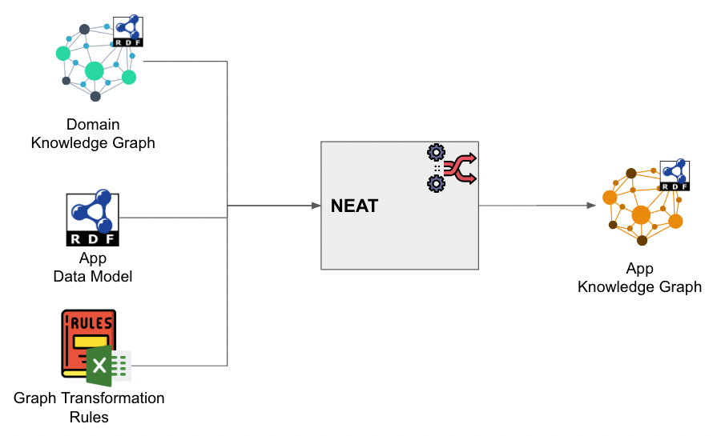

# kNowlEdge grAph Transformer (NEAT)

[](https://github.com/cognitedata/neat/actions/workflows/release_pypi.yaml)
[](https://cognite-neat.readthedocs-hosted.com/en/latest/?badge=latest)
[](https://github.com/cognitedata/neat)
[](https://pypi.org/project/cognite-neat/)
[](https://pypistats.org/packages/cognite-neat)
[](https://hub.docker.com/r/cognite/neat)
[](https://github.com/cognitedata/neat/blob/master/LICENSE)
[](https://github.com/ambv/black)
[](https://github.com/astral-sh/ruff)
[](http://mypy-lang.org)

This is python package handles transformation of domain knowledge graphs (more detailed, overarching) to app specific knowledge graphs.
Documenation available at [https://thisisneat.io](https://thisisneat.io).

## Quickstart

### Option 1 - Python Package

`neat` can be installed as a Python package, and a docker image for more robust execution and support such
as `graphdb` for caching. This quickstart guide uses the Python package.

### Option 2 - Docker container

Running NEAT as docker container :
`docker run -p 8000:8000 --name neat cognite/neat:latest`

Runnin NEAT as docker container with local data folder mounted :
`docker run -p 8000:8000 --name neat -v $(shell pwd)/docker/vol_data:/app/data  cognite/neat:latest`

### Installation (Development setup)

Prerequisites:

- `poetry` installed on your system, [see installation](https://python-poetry.org/docs/).
- `npm` installed on your system, [see installation](https://docs.npmjs.com/downloading-and-installing-node-js-and-npm)
- `react-scripts` installed on your system, [`npm i react-scripts`](https://www.npmjs.com/package/react-scripts)

1. Clone this repo: `git clone git@github.com:cognitedata/neat.git`
2. Create wheel: `make build-python`. This will create a wheel in the `dist` folder.
3. Install wheel in your preferred environment, `pip install dist/neat-[NEAT_VERSTION]-py3-none-any.whl`

### Run Neat (Python Package)

Once installed you can run neat with the command

```bash
neat
```

This will open your browser and launch the neat application.

Note this will automatically create a `data` folder in your current working directory, which is populated
with default workflows, rule sheets, and source graphs. In addition, there is a `config.yaml` you can add
your CDF credentials to allow `neat` access CDF.


## Documentation

[Documentation](https://cognite-neat.readthedocs-hosted.com/en/latest/)



## Docker container build process

`make build-docker`

## Starting the application locally using GraphDB as external rdf store

Run the command :

` make compose-up`

The command starts NEAT container and GraphDB container and creates _vol_data_ and _vol_shared_ local folders that are mounted as volumes.

_vol_data_ - is mounted only in NEAT container. It contains `config.yaml`, `workflows`, `rules`. You can set `load_examples` to `true` to populate it with examples.

_vol_shared_ - is mounted to both containers and files placed here become automatically visible for GraphDB import process. Main intension is to write files from NEAT container and make them available for GraphDB for import.

## Web UI

`http://localhost:8000`

Open API docs :

`http://localhost:8000/docs`

Prom metrics :

`http://localhost:8000/metrics`

## Workflows and configurations

All configurations are divided into 2 categories :

- global configurations - global for entire service , loaded at startup (config.yaml)
- workflow configurations - local to workflow , loaded from workflow manifest (.yaml)

## Global configurations

Global configurations loaded by the application during startup process, either from ENV variables or file.

The application tries to load the configuration as follows.

1. Try ENV variables. This is done by checking for the ENV variable `NEAT_CDF_PROJECT`, and if it exists load the rest
   as they are listed below.
2. Try from file. This is done by checking the ENV variable `NEAT_CONFIG_PATH`, which defaults to `$(cwd)/config.yaml`,
   for a path. The config file es expected to have the structure as shown below.
3. Exit. It the ENV variable `NEAT_CDF_PROJECT` and the config file does not exist, the applications exists.

### Env Variables

- NEAT_CDF_PROJECT
- NEAT_CDF_CLIENT_NAME
- NEAT_CDF_CLIENT_ID
- NEAT_CDF_CLIENT_SECRET
- NEAT_CDF_BASE_URL
- NEAT_CDF_TOKEN_URL
- NEAT_CDF_SCOPES
- NEAT_WORKFLOW_DOWNLOADER_FILTER - list of workflows or tags that must be loaded from CDF automatically during startup
- NEAT_DATA_PATH - local directory for workflow and rules storage
- NEAT_CDF_DEFAULT_DATASET_ID - default dataset id that is used for sharing workflows, rules fies and execution traces
- NEAT_LOG_LEVEL - supported logging levels `DEBUG` , `INFO` (default)

### Config file

```yaml
workflows_store_type: file
data_store_path: /app/data

cdf_client:
  project: get-power-grid
  client_id: "623c2450-cfc2-43d6-9036-10e14dad8ccf"
  client_secret: "my-super-secret"
  base_url: https://az-power-no-northeurope.cognitedata.com
  scopes:
    - https://az-power-no-northeurope.cognitedata.com/.default
  token_url: https://login.microsoftonline.com/e55e1701-82f8-4c52-af10-28e4d942c589/oauth2/v2.0/token

cdf_default_dataset_id: 2626756768281823
workflow_downloader_filter:
  - tag:grid
log_level: DEBUG
```

## Automatic workflow loading from CDF during application startup

If `workflow_downloader_filter` is set, the app will try to download workflows from CDF based on provided filtering conditions .
Filtering format :

- `name:<workflows_name>=<workflow_version>` - loading workflow by name and version or latest by name if version is not set.
- `tag:<tag_name>`- loading all workflows that tagged with specific tag.
