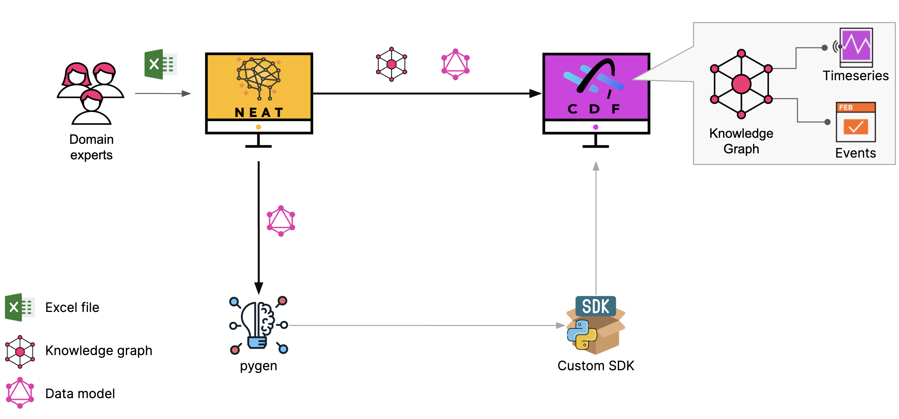

# kNowlEdge grAph Transformer (NEAT)

This is python package handles transformation of domain knowledge graphs (more detailed, overarching) to app specific knowledge graphs.

## Quickstart

### Option 1 - Python Package
`neat` can be installed as a Python package, and a docker image for more robust execution and support such
as `graphdb` for caching. This quickstart guide uses the Python package.

### Option 2 - Docker container

Running NEAT as docker container :
`docker run -p 8000:8000 --name neat cognite/neat:latest`

Runnin NEAT as docker container with local data folder mounted :
`docker run -p 8000:8000 --name neat -v $(shell pwd)/docker/vol_data:/app/data  cognite/neat:latest`


### Installation (Development setup)
Prerequisites:
* `poetry` installed on your system, [see installation](https://python-poetry.org/docs/).
* `npm` installed on your system, [see installation](https://docs.npmjs.com/downloading-and-installing-node-js-and-npm)
* `react-scripts` installed on your system, [`npm i react-scripts`](https://www.npmjs.com/package/react-scripts)

1. Clone this repo: `git clone git@github.com:cognitedata/neat.git`
2. Create wheel: `make build-python`. This will create a wheel in the `dist` folder.
3. Install wheel in your preferred environment, `pip install dist/neat-[NEAT_VERSTION]-py3-none-any.whl`


### Run Neat (Python Package)

Once installed you can run neat with the command
```bash
neat
```
This will open your browser and launch the neat application.

Note this will automatically create a `data` folder in your current working directory, which is populated
with default workflows, rule sheets, and source graphs. In addition, there is a `config.yaml` you can add
your CDF credentials to allow `neat` access CDF.


## Documentation

[Documentation](https://neat-docs.app.cogniteapp.com/)




## Docker container build process


``` make build-docker ```

## Starting the application locally using GraphDB as external rdf store

Run the command :

``` make compose-up```

The command starts NEAT container and GraphDB container and creates *vol_data* and *vol_shared* local folders that are mounted as volumes.

*vol_data* - is mounted only in NEAT container. It contains `config.yaml`, `workflows`, `rules`. You can set `load_examples` to `true` to populate it with examples.

*vol_shared* - is mounted to both containers and files placed here become automatically visible for GraphDB import process. Main intension is to write files from NEAT container and make them available for GraphDB for import.


## Web UI

``` http://localhost:8000 ```

Open API docs :

``` http://localhost:8000/docs ```

Prom metrics :

``` http://localhost:8000/metrics ```


## Workflows and configurations

All configurations are divided into 2 categories :
- global configurations - global for entire service , loaded at startup (config.yaml)
- workflow configurations - local to workflow , loaded from workflow manifest (.yaml)


## Global configurations

Global configurations loaded by the application during startup process, either from ENV variables or file.

The application tries to load the configuration as follows.

1. Try ENV variables. This is done by checking for the ENV variable `NEAT_CDF_PROJECT`, and if it exists load the rest
   as they are listed below.
2. Try from file. This is done by checking the ENV variable `NEAT_CONFIG_PATH`, which defaults to `$(cwd)/config.yaml`,
   for a path. The config file es expected to have the structure as shown below.
3. Exit. It the ENV variable `NEAT_CDF_PROJECT` and the config file does not exist, the applications exists.

### Env Variables

- NEAT_CDF_PROJECT
- NEAT_CDF_CLIENT_NAME
- NEAT_CDF_CLIENT_ID
- NEAT_CDF_CLIENT_SECRET
- NEAT_CDF_BASE_URL
- NEAT_CDF_TOKEN_URL
- NEAT_CDF_SCOPES
- NEAT_WORKFLOW_DOWNLOADER_FILTER - list of workflows or tags that must be loaded from CDF automatically during startup
- NEAT_DATA_PATH - local directory for workflow and rules storage
- NEAT_CDF_DEFAULT_DATASET_ID - default dataset id that is used for sharing workflows, rules fies and execution traces
- NEAT_LOG_LEVEL - supported logging levels `DEBUG` , `INFO` (default)

### Config file

```yaml
workflows_store_type: file
data_store_path: /app/data

cdf_client:
    project: get-power-grid
    client_id: "623c2450-cfc2-43d6-9036-10e14dad8ccf"
    client_secret: "my-super-secret"
    client_name: neat-test-service
    base_url: https://az-power-no-northeurope.cognitedata.com
    scopes:
      - https://az-power-no-northeurope.cognitedata.com/.default
    token_url: https://login.microsoftonline.com/e55e1701-82f8-4c52-af10-28e4d942c589/oauth2/v2.0/token

cdf_default_dataset_id: 2626756768281823
workflow_downloader_filter:
    - tag:grid
log_level: DEBUG
```

## Automatic workflow loading from CDF during application startup

If `workflow_downloader_filter` is set, the app will try to download workflows from CDF based on provided filtering conditions .
Filtering format :
- `name:<workflows_name>=<workflow_version>` - loading workflow by name and version or latest by name if version is not set.
- `tag:<tag_name>`- loading all workflows that tagged with specific tag.

## Workflow level configurations

Each workflow can have own unique subset of configurations defined in `config.yaml` file. There is also a small subset of system
configurations that can be set on workflow level.

System configurations:

- system.execution_reporting_type - controls how workflow execution log should be reported to CDF . Supported values : `all_disabled`, `all_enabled`(default)

Example :
```yaml
-   group: system
    name: system.execution_reporting_type
    value: all_disabled
```

## How to develop your first workflow

The NEAT framework has few conventions :
- Each workflow must reside in its own folder
- Workflow folder must contain at least 2 files :
    - `workflow.py` - steps implementation file
    - `workflow.yaml` - manifest and configurations

 ### Workflow steps implementation file

 Must implement `BaseWorkflow` class from `from cognite.neat.core.workflow.base`

 Each method that should be orchestrated by workflow engine must be prefixed with `step_` , each method must have single argument of `FlowMessage` type and return `FlowMessage` or `None`.
 FlowMessage is passed from one step to another and it's captured in execution log.

Simplest `workflow.py`
````python

import logging
from cognite.client import CogniteClient
from cognite.neat.core.workflow.base import BaseWorkflow
from cognite.neat.core.workflow.model import FlowMessage


class PlaygroundNeatWorkflow(BaseWorkflow):
    def __init__(self, name: str, client: CogniteClient):
        super().__init__(name, client, [])

    def step_run_experiment_1(self, flow_msg: FlowMessage = None):
        logging.info("Running experiment 1")
        logging.info("Done running experiment 4444")

        return FlowMessage(output_text="Done running experiment 1")

    def step_cleanup(self, flow_msg: FlowMessage = None):
        logging.info("Cleanup")

````

Manifest `workflow.yaml` , normally should be updated from UI
````yaml
configs:
-   group: source_rdf_store
    label: null
    name: source_rdf_store.type
    options: null
    required: false
    type: null
    value: graphdb
description: null
groups:
-   description: null
    id: experimentation_system
    label: Experimentation playground
    transition_to: null
    ui_config:
        pos_x: 171
        pos_y: 6
implementation_module: null
name: playground
steps:
-   description: null
    enabled: true
    group_id: null
    id: run_experiment_1
    label: Running first experiment
    method: null
    params: {}
    stype: pystep
    transition_to:
    - cleanup
    trigger: false
    ui_config:
        pos_x: 340
        pos_y: 144
-   description: null
    enabled: true
    group_id: null
    id: cleanup
    label: Cleanup
    method: null
    params: null
    stype: pystep
    transition_to: []
    trigger: false
    ui_config:
        pos_x: 295
        pos_y: 303
-   description: null
    enabled: true
    group_id: null
    id: step_trigger
    label: HTTP trigger
    method: null
    params: {}
    stype: http_trigger
    transition_to:
    - run_experiment_1
    trigger: true
    ui_config:
        pos_x: 336
        pos_y: 44
-   description: null
    enabled: false
    group_id: null
    id: step_295076
    label: Run every 10 sec
    method: null
    params:
        interval: every 10 seconds
    stype: time_trigger
    transition_to:
    - run_experiment_1
    trigger: true
    ui_config:
        pos_x: 544
        pos_y: 42


````
