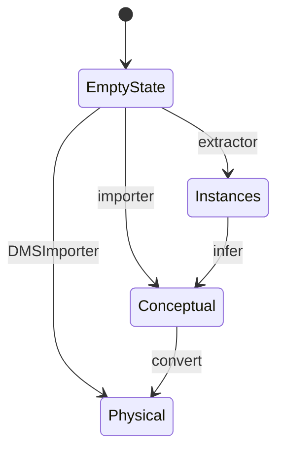

# NeatState

The neat state controls the `NeatGraphStore` and `NeatRuleStore`. It is implementing a state machine pattern
to ensure valid state transitions. The diagram below shows the state machine:

