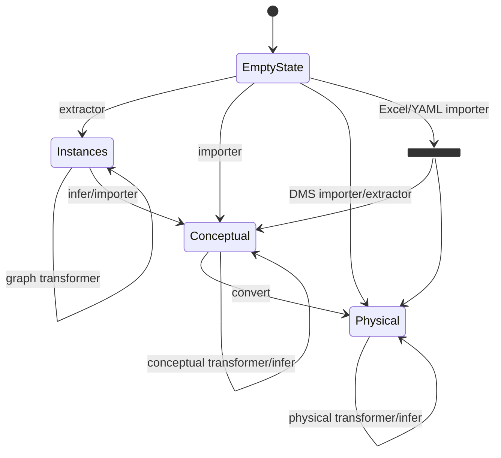

# NeatState

**IN DEVELOPMENT**
The neat state controls the `NeatInstanceStore` and `NeatGraphStore`. It is implementing a state machine pattern
to ensure valid state transitions. The diagram below shows the state machine:

