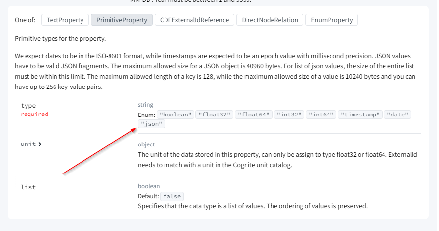

# Properties

This section contains elaborations of the different fields in the properties sheet.

There are two types of properties in physical data model (DMS): `Connection` and `Data`. The `Connection` property is used to
specify how nodes are connected, while the `Data` property is used to specify the data that is stored on the node.
These concepts match a `Entity` and `Literal` in semantic modeling. It is recommended that you use `PascalCase` for
views, neat uses `camelCase` for data properties. This makes it easier to distinguish between the two by looking
at the `Value Type` column in the `Properties` sheet.

## Data Property
A data property is used to specify the data that is stored on the node (also known as node attributes). Below is an example of a data property:

| View        | View Property | Value Type                | Container      | Container Property |
|-------------|---------------|---------------------------|----------------|--------------------|
| WindTurbine | capacity      | float64(unit=power:megaw) | GeneratingUnit | capacity           |

This data property specifies that the `WindTurbine` view has a property called `capacity` that is a holding vLUW of type float64 with the unit
`power:megaw`. The data is stored in the `GeneratingUnit` container with the property `capacity`.

To see which value types are supported, see the
[CDF API Spec for Container Creation](https://api-docs.cognite.com/20230101/tag/Containers/operation/ApplyContainers) section.
The `container.properties.type.type` field specifies the type of the property.

There are two `Value Type` that supports extra parameters

* `float32` and `float64` - These are used to specify floating-point numbers. The `unit` parameter is
   used to specify the unit of the number. See [Units](../units.md) for available units. See example above.
* `enum` - This is used to specify an enumeration. You need to set `collection` to the name of the enumeration and,
   optionally, `unknownValue` to the value that should be used when the value is unknown. See example below. When
   enumerations are used, there is expected to be a corresponding `enum` sheet in the physical data model file with the
   enumeration values.

| View        | View Property | Value Type                                      | Container   | Container Property |
|-------------|---------------|-------------------------------------------------|-------------|--------------------|
| WindTurbine | category      | enum(collection=category, unknownValue=onshore) | WindTurbine | category           |

### Index

For data properties, you can specify an index. The index is used to speed up queries on the property. The syntax is as
follows:

| View        | View Property | Value Type | Container      | Container Property | Index                            |
|-------------|---------------|------------|----------------|--------------------|----------------------------------|
| WindTurbine | name          | text       | GeneratingUnit | name               | btree:nameIndex(cursorable=True) |

Note that you can specify whether the index is cursorable or not, see 
[here](https://docs.cognite.com/cdf/dm/dm_guides/dm_performance_considerations/#pagination-cursorable-indexes).

You can also specify indices that uses multiple data properties. You can do this by specifying the same `Index` name
for multiple properties. When you specify an index on multiple properties you must specify the order these properties
should be used. See the example below:

| View        | View Property | Value Type | Container      | Container Property | Index                               |
|-------------|---------------|------------|----------------|--------------------|-------------------------------------|
| WindTurbine | name          | text       | GeneratingUnit | name               | inverted:nameCapacityIndex(order=1) |
| WindTurbine | capacity      | float64    | GeneratingUnit | capacity           | inverted:nameCapacityIndex(order=2) |

There are two available index types, `btree` which should be used for non-list properties and `inverted` which should
be used for list properties. If you do not specify the index type, it will default to `btree` for non-list properties
and `inverted` for list properties. 

| View        | View Property | Value Type | Container      | Container Property | Index              |
|-------------|---------------|------------|----------------|--------------------|--------------------|
| WindTurbine | tags          | text       | GeneratingUnit | name               | inverted:tagsIndex |

## Connection Property

All connections have a `ValueType` that specifies the type of the connected node. For example:

| View          | ViewProperty       | Connection | Value Type  | Is List |
|---------------|------------------  |------------|-------------|---------|
| WindTurbine   | blades             | direct     | Blade       | True    |

This connection specifies that the `WindTurbine` view has a property called `blades` that is a direct relation to the `Blade` view.
In addition, the `Is List`, specifies that there can be multiple blades connected to a wind turbine.

#### Connection Implementation

The column `Connection` specifies how the connection is implemented in the CDF data model and can be one of the following:

* Direct relation—This is cheap in terms of storage and query time.
* Edge connection—This is more flexible, but more expensive in terms of storage and query time.
* Reverse connection—This is used to specify a connection from the other end of a direct relation or edge connection.

To get more details on the difference, see the [ data modeling documentation](https://docs.cognite.com/cdf/dm/dm_concepts/dm_spaces_instances#direct-relations-vs-edges).
Note that in addition to the mentioned differences, direct relations have an upper limit of 1000 connection per node.

The syntax for the `Connection` column is as follows:

* `direct` - This specifies a direct relation. There are no extra parameters. Note, however, that you need to
   specify `Container` and `Container Property` as `direct` connections are stored in the container.
* `edge` - This specifies an edge connection. You can, optionally, specify `type`, `properties`,
   and `direction` as extra parameters.
* `reverse` - This specifies a reverse connection. You need to specify the `property` that the connection is
   reversing.

**Edge example**:

| View        | ViewProperty | Connection                                                 | Value Type             | Is List |
|-------------|--------------|------------------------------------------------------------|------------------------|---------|
| WindTurbine | metmasts     | edge(type=distance,properties=Distance,direction=outwards) | MetMast                | True    |
| Distance    | distance     |                                                            | float64(unit=length:m) | False   |

This connection specifies that the `WindTurbine` view has a property called `metmasts` that is an edge connection
to the `MetMast` view. The edges are of type `distance` and have properties stored in the `Distance` view. The
`Distance` view has a property called `distance` that is a float64 with the unit `length:m`.

Why is both `type` and `properties` needed? The `type` specifies the type of the edge, this is used for filtering
when querying the data model. The `properties` specifies the properties that are stored on the edge. This is used
to store data on the edge. In the example above, we can, for example, write a query that returns all MetMast
(Wheather Station) that are connected to a WindTurbine with a distance less than 100 meters.

**Reverse example**:

| View       | ViewProperty   | Connection                 | Value Type   | Is List |
|------------|----------------|----------------------------|--------------|---------|
| MetMast    | windTurbines   | reverse(property=metmasts) | WindTurbine  | True    |

This connection specifies that the `MetMast` view has a property called `windTurbines` that is a reverse connection
of the `metmasts` property in the `WindTurbine` view. The `Is List` specifies that there can be multiple wind turbines
connected to a MetMast.

Connecting this example to the previous example, we see that the reverse here will be an edge that is pointing the
opposite direction of the `WindTurbine`.`metmasts` edge. The reverse enable use to easily reuse the same edge
for both directions.

## Index 