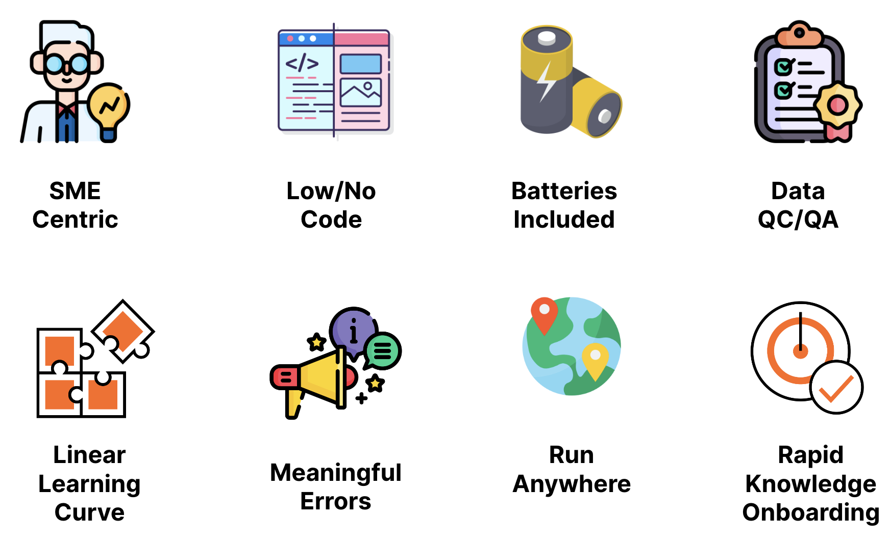

# Features Overview

This section provides a high-level overview of the NEAT features. Where possible, links to more detailed documentation are provided.

## Domain Expert Centric

NEAT is a domain expert-centric application, meaning that it is designed to be used by subject matter experts rather than just developers. Overall, NEAT's domain expert-centric approach helps to bridge the gap between business needs and technical implementation, resulting in more effective and efficient data modeling.

## Low/No Code

NEAT provides a low/no-code environment for creating data modeling and knowledge graph workflows. This approach enables subject matter experts to easily create and manage data models without needing extensive programming knowledge, resulting in more accurate and relevant models that better reflect the needs of the business. The underlaying methods are wrapped in steps, which are exposed through UI for building so-called knowledge onboarding workflows.

## Batteries Included

NEAT provides a batteries-included environment for creating data modeling and knowledge graph workflows. This means that the application includes pre-built components that enable users to quickly and easily create desired solutions.

## Modular Design

NEAT's well-defined interfaces and separation of concerns make it simple to add missing features. The application's modular architecture allows for easy integration of new components, and the well-defined interfaces ensure that new components can be added without disrupting the existing underlaying library. This approach enables developers to quickly add missing features and extend the functionality of NEAT, without needing to rewrite large portions of the codebase. Overall, NEAT's architecture provides a flexible and scalable platform for data modeling and knowledge graph workflows.

## Data QC/QA

NEAT provides extensive QA/QC (Quality Assurance/Quality Control) features that safeguard Cognite Data Fusion from 'rubbish' data models and graphs. These features ensure that the data models and knowledge graphs created in NEAT are accurate and reliable, prior landing in Cognite Data Fusion, and that they meet the required standards and specifications. The QA/QC features include data validation, error checking, and data lineage tracking, which help to identify and correct errors in the data models.

## Meaningful Errors

NEAT provides meaningful errors that help users rapidly fix errors in their data models and knowledge graphs. The application's error messages are designed to be clear and concise, making it easy for users to understand what went wrong and how to fix it. This approach helps to reduce the time and effort required to correct errors, enabling users to quickly iterate and improve their models.

## Linear Learning Curve

NEAT enables a linear learning curve due to its thorough design. The application's user-friendly interface and pre-built components make it easy for users to quickly learn and understand the data modeling process.

## Run Anywhere

NEAT has the ability to run anywhere, whether it be locally or on infrastructure. This means that users can choose to run NEAT on their own local machine or on a cloud-based infrastructure, depending on their specific needs and requirements. This approach provides users with the flexibility to choose the deployment option that best suits their needs, while still being able to take advantage of NEAT's powerful data modeling and knowledge graph capabilities. Overall, NEAT's ability to run anywhere makes it a versatile and scalable solution for data modeling and knowledge graph workflows.

## Rapid Knowledge Onboarding

NEAT's features, including its low/no-code environment, batteries-included approach, modular design, extensive QA/QC features, meaningful errors, linear learning curve, and ability to run anywhere, enables rapid knowledge (i.e.,data models and graphs) onboarding.
