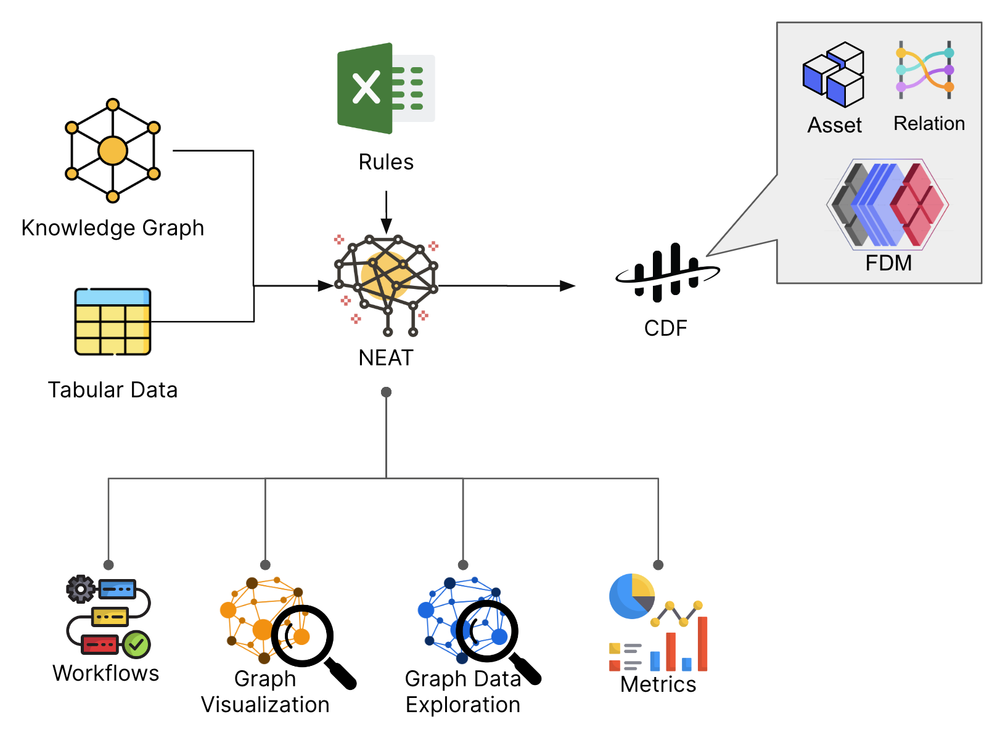
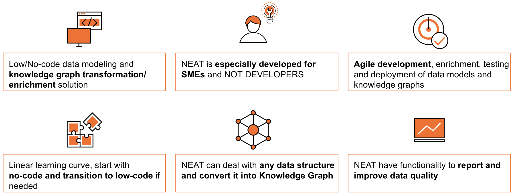

# Welcome to NEAT
  

NEAT is a low/no code data modeling platform tailored for domain experts with or without technical or information architecture background who need a simple solution that enables agile:

- data modeling
- creation, transformation and enrichment of knowledge graphs
- ingestion of knowledge graphs into CDF

NEAT is using open and globally recognized standards maintained by the [World Wide Web Consortium (W3C)](https://www.w3.org/RDF/), assuring long-term resilience while alleviating vendor locking.

NEAT represents a fundamental tool for creation of standardized, machine-actionable, linked and contextualized (meta)data.

Examples of use cases for which NEAT is great:

* Onboarding of domain experts to the semantic information modeling and knowledge graphs
* Semantic data model development and deployment to CDF
* Conversion of (meta)data to knowledge graphs
* Simplification of large and complex domain data models and knowledge graphs
* Enrichment of knowledge graphs with additional information
* Ingestion of knowledge graphs to CDF

Examples of use cases for which NEAT is not suited

* Reasoning over semantic data models and knowledge graphs
* Visual data modeling (we use Excel sheet for that)

> NEAT is an acronym derived from k**N**owl**Ed**ge gr**A**ph **T**ransformer.