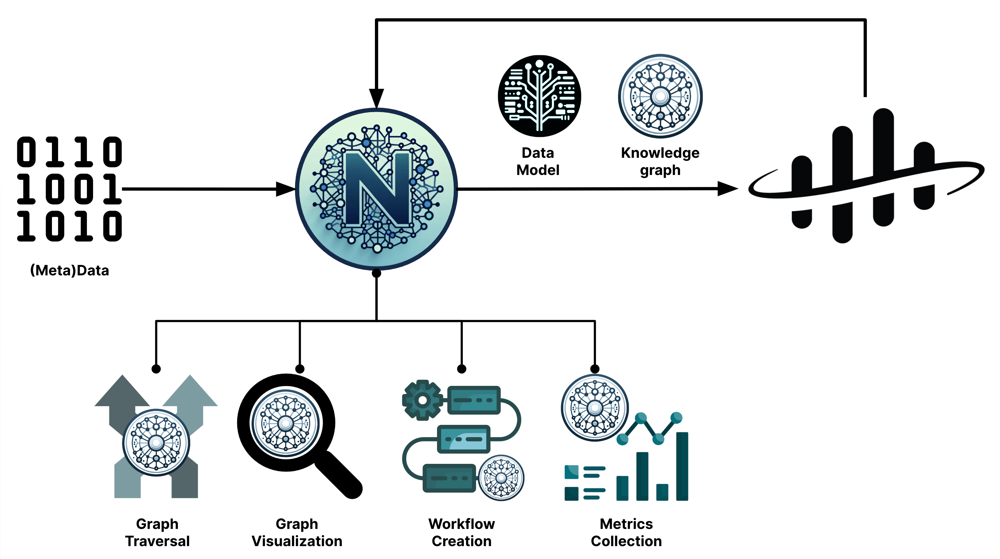

# Welcome to NEAT

!!! warning annotate "Work in Progress"
    This page is work in progress and will be updated continuously until version 1.0.0 is released.

NEAT is [an open source](https://github.com/cognitedata/neat/blob/main/LICENSE), domain expert centric and developer friendly solution for rapid:

- semantic data modeling
- creation, transformation and enrichment of knowledge graphs
- and ingestion of the models and graphs to [Cognite Data Fusion](https://www.cognite.com/en/product/cognite_data_fusion_industrial_dataops_platform)

Accordingly, NEAT supports two flows:

- [Data Modeling Flow](./data-modeling-flow.md)
- [Graph ETL Flow](./graph-etl-flow.md)

NEAT is using open and globally recognized standards maintained by the [World Wide Web Consortium (W3C)](https://www.w3.org/RDF/).

NEAT represents a fundamental tool for creation of standardized, machine-actionable, linked and contextualized (meta)data.

# NEAT is great for...

- Onboarding of domain experts to the semantic data modeling and knowledge graphs
- Semantic data model development and deployment to Cognite Data Fusion
- Conversion of (meta)data to knowledge graphs
- Simplification of large and complex domain data models and knowledge graphs
- Enrichment of knowledge graphs with additional information
- Ingestion of knowledge graphs to CDF
- Staging and playground area for data models and knowledge graphs

# NEAT is not meant as...

- Long-term solution for storage of data models and knowledge graphs
- Reasoning over semantic data models and knowledge graphs
- Visual data modeling (see [Data Modeling using Spreadsheets](./rules.md))

> NEAT is an acronym derived from k**N**owl**Ed**ge gr**A**ph **T**ransformer hallucinated by GenAI.
