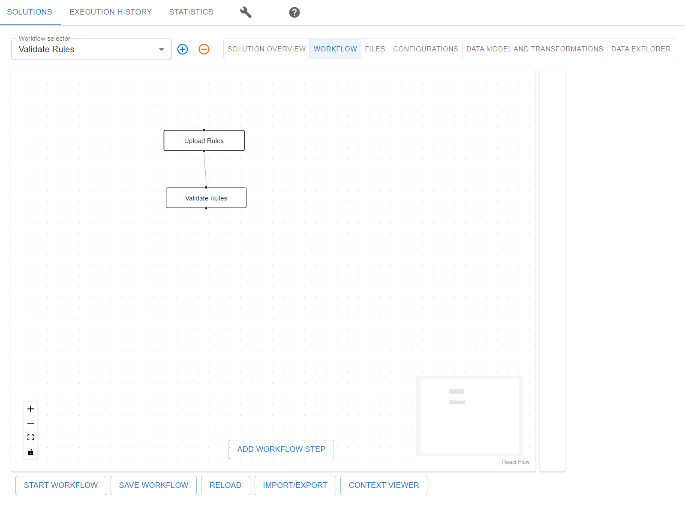
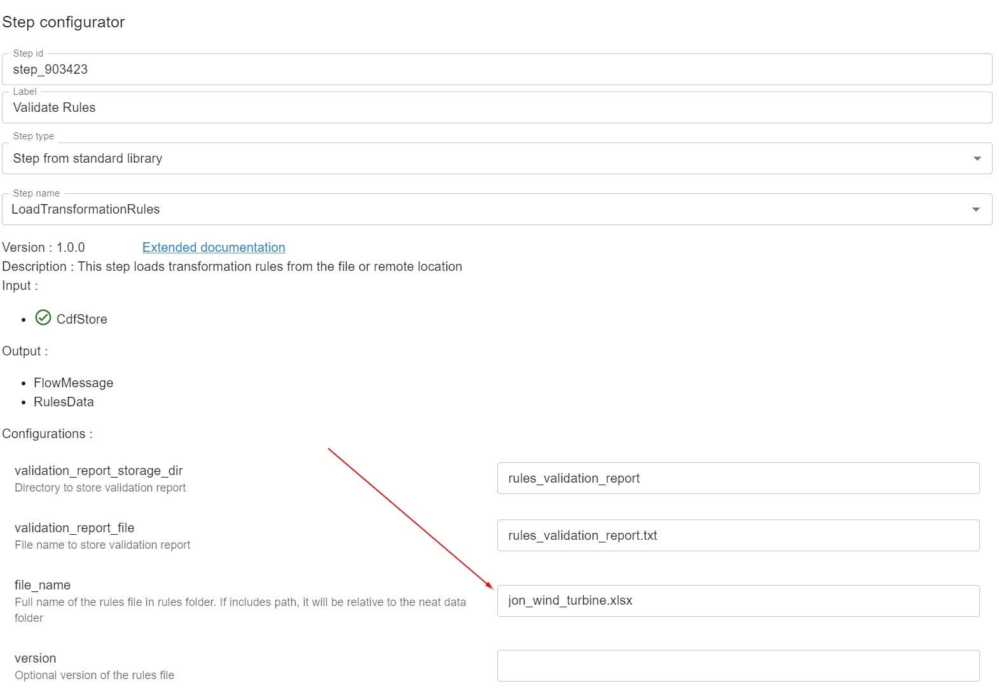
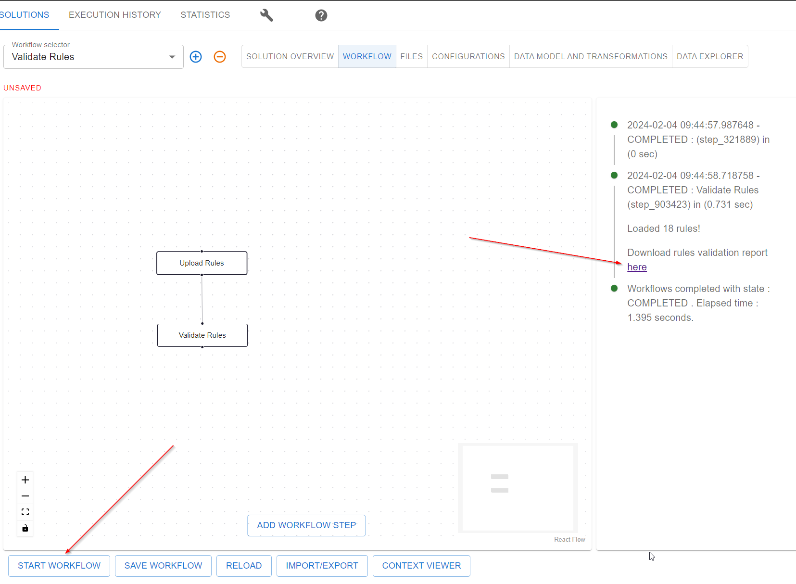

# Knowledge Acquisition / Building an Enterprise Data Model

!!! note annotate "Warning"
    This tutorial is a work in progress and is not yet complete.

This tutorial covers how to use `neat` for knowledge acquisition and produce a shared data model in
Cognite Data Fusion (CDF). The process of knowledge acquisition follow the so-called
[Expert Elicitation](https://en.wikipedia.org/wiki/Expert_elicitation), and represtents the recommended way of
building enterprise data models.

## Introduction

Companies typically have multiple domain experts that cover different areas of the business. Typically, these
areas are partially overlapping, both in concepts and data. Lots of the value in a product like CDF comes from
taking data from different sources and making it easily accessible and understandable for all domain experts, as
this unlocks the potential for cross-domain insights.

Knowledge acquisition is the process of taking the knowledge from domain experts and turning it into a shared
data model, also known as Enterprise Data Model (covering the entire suite of use-cases and domains and business units).
`neat` has been designed to facilitate this process by providing a way to define a shared data model.

## Use Case

In this tutorial, we will focus on the Power & Utilities industry. We will have two domain experts, one that
focuses on wind turbine maintenance and one that focuses on grid analysis, lets call them Jon and Emma. In addition,
we will have an information architect, let's call him David, who will be responsible for combining the
knowledge from Jon and Emma into a shared data model. Finally, we have a CDF expert, let's call her Alice,
who will be responsible for implementing the shared data model in CDF. Note that in a real-world scenario,
the information architect and the CDF solution architect (DMS - domain model service architect) might be the same
person, but for the purpose of this tutorial, we will keep them separate to highlight that their required skills
and use of `neat` are different.

**Note** You don't need to be an expert in the Power & Utilities industry to follow this tutorial. The concepts
are generic and can be applied to any industry in which you have domain experts with overlapping knowledge and data.

## Wind Turbine Maintenance Expert: Jon

### Gathering Knowledge
In `neat`, knowledge is captured in statements. A statement is a simple fact. We will often refer to it as a `property`.
For example, Jon might say that a wind turbine has a `name`, a `location`, and a `manufacturer`. These are all
statements. In `neat`, we capture these statements in a spreadsheet format. We refer to a set of
statements as `properties`. The `properties` sheet looks as follows for a domain expert like Jon:

| Class       | Property     | Description | Type   | Min Count | Max Count |
|-------------|--------------| ----------- |--------|-----------|-----------|
| WindTurbine | name         |             | string | 1         | 1         |
| WindTurbine | location     |             | string | 0         | 1         |
| WindTurbine | manufacturer |             | string | 0         | 1         |

In each row of the `properties` sheet, Jon will define a statement. For example, the first row says that a
`WindTurbine` has a `name`. In addition, Jon can add a `description`, i.e., a human-readable explanation of the
statement. The three next columns help the data engineer, David, to understand how to model the data. First, we have the
`Type` column, which specify what type of data this statement is about. Is this a number, an on/off value, text,
or something else? In this case, the `name`, `location`, and `manufacturer` are all strings, meaning they are
expected to be text. The `Min Count` and `Max Count` columns specify how many data points are expected. In the
first row, we see that a `WindTurbine` is expected to have exactly one `name`. In the second and third row, we see
that a `WindTurbine` can have zero or one `location` and `manufacturer`. In other words, we these two properties
are optional. Even though all `WindTurbines` have a manufacturer, Jon knows that we do not always have this
information, so he has specified that it is optional.

In the `properties` sheet, we introduce the concept of a `Class`. Classes are used to group properties, and the
set of properties for a class defines what it means to be a member of that class. In `neat`, classe have
their own sheet, where we define the class and its description. For example, Jon might define the `WindTurbine`
class as follows:

| Class       | Description                                         | Parent Class |
|-------------|-----------------------------------------------------|--------------|
| WindTurbine | A device that converts wind to electrical energy    |              |
| Nacelle     | The covering house of all the generating components | WindTurbine  |
| Rotor       | The rotating part of the wind turbine               | WindTurbine  |

In addition, to `Class` and `Description` columns, we have a `Parent Class` column. This column is used to define
that a hierarchy of classes. For example, Jon has defined that a `Nacelle` and a `Rotor` are both types of a `WindTurbine`.
This column is optional, and if a class does not have a parent class, we leave the cell empty.

In the `Types` column in the `properties` sheet, we can use basic types like `string`, `number`, `boolean`, `date`,
`timeseries`, but in addition we cal also use classes. For example, after Jon has defined the `Nacelle` and `Rotor`
classes, he can now go back to the `properties` sheet and define that a `WindTurbine` has a `nacelle` and a `rotor`.

| Class       | Property     | Description | Type       | Min Count | Max Count |
|-------------|--------------| ----------- |------------|-----------|-----------|
| WindTurbine | name         |             | string     | 1         | 1         |
| WindTurbine | location     |             | string     | 0         | 1         |
| WindTurbine | manufacturer |             | string     | 0         | 1         |
| WindTurbine | nacelle      |             | Nacelle    | 1         | 1         |
| WindTurbine | rotor        |             | Rotor      | 1         | 1         |

Note that the above two statements defines the relationship between the `WindTurbine` class and the `Nacelle` and `Rotor`.

In addition to the `properties` and `classes` sheets, `neat` also requires one more sheet `Metadata` for domain experts.
The `Metadata` sheet is used to define the domain expert's name, the date of the knowledge acquisition, and a description
of the domain expert's knowledge. This is useful for the traceability of the knowledge acquisition process.

|         |               |
|---------|---------------|
| role    | domain expert |
| creator | Jon           |

You can find the complete `properties`, `classes`, and `metadata` sheets for Jon here.

### Validating Statements in Neat
When Jon has defined all the statements, he can validate the sheet using `neat`. This will check that all the
statements are correctly defined and that there are no inconsistencies. For example, that all properties
are using valid characters in their names.

To validate his sheet, Jon opens the `neat` UI and selects the `Validate Rules` workflow:

Then, his sheet is named `jon_wind_turbine.xlsx`, and he needs to go into the `Validate Rules` step and
change the configuration to point to his sheet:

Finally, he can click the `RunWorkflow` button to validate his sheet and it will outut a report with any errors
and warnings.

### Summary

**Domain Expert Task.**

1. (Required) Gathering statements in a spreadsheet.
2. (Optional) Defining classes in a spreadsheet.

**Domain Expert usage of `neat`**:

1. Validate the sheet using the `neat` UI.

## Grid Analysis Expert: Emma

### Gathering Knowledge
Similarly to Jon, Emma will define a set of statements in a spreadsheet. For example, she might define that a
`Substation` has a `name`, a `location`, and a `voltage`. In addition, she might define that a `Substation` has
a `transformer` and a `circuit breaker`, and she has also added a `WindGenerator` that has a name.
The `properties` sheet for Emma might look as follows:

| Class         | Property        | Description | Type           | Min Count | Max Count |
|---------------|-----------------| ----------- |----------------|-----------|-----------|
| Substation    | name            |             | string         | 1         | 1         |
| Substation    | location        |             | string         | 0         | 1         |
| Substation    | voltage         |             | timeseries     | 1         | 1         |
| Substation    | transformer     |             | Transformer    | 1         | 1         |
| Substation    | circuit breaker |             | CircuitBreaker | 1         | 1         |
| WindGenerator | name            |             | name           | 1         | 1         |

Furthermore, Emma might define the `Substation` class as follows:

| Class          | Description                                       | Parent Class |
|----------------|---------------------------------------------------|--------------|
| Substation     | A part of an electrical grid                      |              |
| Transformer    | A device that changes the voltage of electricity  | Substation   |
| CircuitBreaker | A device that can stop the flow of electricity    | Substation   |

You can find the complete `properties`, `classes`, and `metadata` sheets for Emma here.

Finally, Emma will validate her sheet using the `neat` UI, just like Jon did.

|         |               |
|---------|---------------|
| role    | domain expert |
| creator | Jon           |

### Summary

**Domain Expert Task.**

1. (Required) Gathering statements in a spreadsheet.
2. (Optional) Defining classes in a spreadsheet.

**Domain Expert usage of `neat`**:

1. Validate the sheet using the `neat` UI.

## Information Architect: David

### Creating the Shared Data Model

Once Jon and Emma have defined their statements, David will combine the two sheets into a single sheet. This is
done by simply copying the statements from Jon and Emma into a single sheet. For example, the `properties` sheet
for David might look as follows:

| Class         | Property         | Description | Type           | Min Count | Max Count |
|---------------|------------------| ----------- |----------------|-----------|-----------|
| WindTurbine   | name             |             | string         | 1         | 1         |
| WindTurbine   | location         |             | string         | 0         | 1         |
| WindTurbine   | manufacturer     |             | string         | 0         | 1         |
| WindTurbine   | nacelle          |             | Nacelle        | 1         | 1         |
| WindTurbine   | rotor            |             | Rotor          | 1         | 1         |
| Substation    | name             |             | string         | 1         | 1         |
| Substation    | location         |             | string         | 0         | 1         |
| Substation    | voltage          |             | number         | 1         | 1         |
| Substation    | transformer      |             | Transformer    | 1         | 1         |
| Substation    | circuit breaker  |             | CircuitBreaker | 1         | 1         |
| WindGenerator | name             |             | name           | 1         | 1         |

In addition, David will also need to combine the `classes` sheets from Jon and Emma. This is done by simply
copying the statements from Jon and Emma into a single sheet. For example, the `classes` sheet for David might

| Class           | Description                                         | Parent Class |
|-----------------|-----------------------------------------------------|--------------|
| WindTurbine     | A device that converts wind to electrical energy    |              |
| Nacelle         | The covering house of all the generating components | WindTurbine  |
| Rotor           | The rotating part of the wind turbine               | WindTurbine  |
| Substation      | A part of an electrical grid                        |              |
| Transformer     | A device that changes the voltage of electricity    | Substation   |
| CircuitBreaker  | A device that can stop the flow of electricity      | Substation   |

In addition, David will need to create a `metadata` sheet for himself, where he sets the
knowledge into context. He would have to add the following rows to the `metadata` sheet:

|             |                       |
|-------------|-----------------------|
| role        | information architect |
| prefix      | power                 |
| namespace   | pwr                   |
| version     | 1                     |
| contributor | Jon, Emma, David      |
| created     | 2021-01-01            |
| updated     | 2021-01-01            |

In the `metadata` sheet, David has added a `prefix` and a `namespace`.

### Iterating over the Sheet

Looking over the `properties` sheet, David notice that `WindGenerator` from Emma and `WindTurbine` from Jon are
very similar. He decides to prompt Emma and Jon for clarification. After a short discussion, they decide that
`WindGenerator` and `WindTurbine` are the same thing, and they decide to use `WindTurbine` as the class name.

An alternative approach would be that keep both classes, but add a property to the `WindGenerator` class that
specifies that it is a type of `WindTurbine`. This would be done by using the `Parent Class` column in the
`classes` sheet.

| Class           | Description                                         | Parent Class   |
|-----------------|-----------------------------------------------------|----------------|
| WindTurbine     | A device that converts wind to electrical energy    | WindGenerator  |

### Extending the Sheet

David will also add two new columns to the `properties` sheet. The first column is called `Source`, and it is used
to specify where the statement comes from, or what standard that matches the statement. The second column is called
`MatchType`, and tells whether the source is partially or fully matching the statement.

| Class         | Property         | Description | Type           | Min Count | Max Count | Source                               | MatchType |
|---------------|------------------| ----------- |----------------|-----------|-----------|--------------------------------------|-----------|
| WindTurbine   | name             |             | string         | 1         | 1         | http://purl.org/windstandard/turbile | full      |

This way David can link the statements up to an existing standard, which sets the knowledge into a broader context.

### Validating in Neat
Like Jon and Emma, David will validate his sheet using the `neat` UI, using the same workflow `Validate Rules`.
Note that since David has set his role as `information architect` in the `metadata` sheet, the validation
from `neat` will be more strict. For example, while Jon and Emma can skip defining anything in the `class` sheet,
David will have to ensure all classes are defined.

The advantage of the additional validation is that it can now unlock additional features in `neat`, such as
visualization and exporting to OWL.

### Exporting to OWL

Once David has validated his sheet, he can export it to OWL. This is done by using the `Export OWL` workflow in
the `neat` UI. This will generate an OWL file that can be used in any ontology tool, such as Protege.

TODO Step by step guide on how to export to OWL.

### Visualization in Neat

Another useful feature of `neat` is that it can visualize the shared data model. This is done by using the
`Visualize` workflow in the `neat` UI. This will generate a graph that shows the classes and properties and how
they are connected.

TODO Step by step guide on how to visualize the shared data model.

### Summary

**Information Architect Task.**

1. Add statements that connect concepts from different domain experts.
2. Add metadata to the sheet.
3. Add source column to the `properties` sheet.
4. Add MatchType column to the `properties` sheet.
5. Find overlapping concepts and prompt domain experts for clarification.
6. Add all classes to the `classes` sheet.

**Information Architect usage of `neat`**:

1. Validate the sheet using the `neat` UI.
2. Visualize the sheet using the `neat` UI.
3. Export the ontology to an open standard format (e.g., OWL, RDF, JSON-LD).

## DMS Architect: Alice

### Implementing the Enterprise Data Model in CDF
Neat supports exporting a data model to CDF either using an `AssetLoader` or `DMSLoader`. The `AssetLoader` is
used to load the data model into the classical `AssetHierarchy` in CDF, while the `DMSLoader` is used to load the
data model into the new Data Modeling Service (DMS) in CDF. The `DMSLoader` is the recommended way to load the
data model into CDF, as it supports more advanced features such as defining dependencies between data. In this
tutorial, we will focus on the `DMSLoader`.

Once David has defined the enterprise data model, Alice will implement it in CDF. The focus of Alice is to make sure
that the enterprise data model is implemented in CDF in a way that accounts for the expected usage of the data. For example, she
needs to define how the data is stored and what properties are indexed for fast queries. In addition, she decides
which dependencies between data should be enforced. This is a trade-off in that being very strict on the data
makes it easy to use as it is predictable. However, it can be hard to populate it as large quantities of the
data might not be in the expected format. On the other hand, being very flexible on the data puts a higher burden
on the developers/users that use the data.

Her tasks can be divided into **performance** and **quality** and summarized as follows:

1. **Performance**:
   - Which indexes to create?
   - The size of the containers.
   - Implement relationships as edges or direct relations.
2. **Quality**:
   - Define constraints between containers
   - Define constraints between properties
   - Define uniqueness constraints on properties
   - Decide which properties should be mandatory.
   - Decide value types for properties (for example int32 vs int64).

### Extending the <code>metadata</code> Sheet

Alice has to modify the `metadata` sheet to include the CDF specific information.

|             |                         |
|-------------|-------------------------|
| role        | dms architect           |
| prefix      | power                   |
| namespace   | pwr                     |
| space       | sp_power                |
| externalId  | power_enterprise_model  |
| version     | 1                       |
| contributor | Jon, Emma, David, Alice |
| created     | 2021-01-01              |
| updated     | 2021-01-01              |

First, she adds herself as a contributor, and then she adds the `space` and `externalId` columns. The `space`
column is used to define the space in CDF where the data model should be loaded. The `externalId` column is used
to define the external id of the enterprise data model. This is used to reference the data model from other parts of CDF.

### The <code>properties</code> Sheet

Using the workflow `To DMS Rules`, Alice will convert the `properties` sheet to a DMS format. This will add
nine new columns as well as modify the `Value Type` column. The first row of the `properties` sheet for Alice
might look as follows:

| Class         | Property         | ValueType | Relation | Nullable | IsList | Container  | Container Property | Index | Constraints | View        | View Property |
|---------------|------------------|-----------|----------|----------|--------|------------|--------------------|-------|-------------|-------------|---------------|
| WindTurbine   | name             | Text      |          | False    | False  | PowerAsset | name               | name  |             | WindTurbine | name          |

`neat` will fill out all the new columns with suggested values, but Alice can modify them as she sees fit and thus
she has granular control over how the data should be stored in CDF.

The columns are as follows:

#### How to store the properties in CDF

* **Value Type**: The values in the Value Type columns are converted to the types supported by DMS. For example, the
  `string` type is converted to `Text`. Alice must still check and potentially modify the value types to ensure
  that they are correct. For example, `float` are converted to `float64`, and Alice might decide to change it to
  `float32` if she knows that the values will never be larger than 32 bits.
* **Relation**: This columns only applies to relationships between entities. It is used to specify how the relationship
  should be implemented in CDF. For example, if the relationship should be implemented as an edge or as a direct
    relation.
* **Nullable**: This only applies to primitive types. This column is used to specify whether the property is
  required or not. For example, Alice might decide that the `name` property of a `WindTurbine` is required,
  and she will set the `Nullable` column to `False`.
* **IsList**: This only applies to primitive types. This column is used to specify whether the property is a list or not.

#### Where to store the properties in CDF

* **Container**: This column is used to specify which container the data should be stored in. For example, Alice might
  decide that the `WindTurbine` data should be stored in a container called `PowerAsset`.
* **Container Property**: This column is used to specify which property in the container that the data should be
  stored in. For example, Alice might decide that the `WindTurbine` data should be stored in a property called `name`
  in the `PowerAsset` container.
* **Index**: This column is used to specify whether the property should be part of an index. For example, Alice might
  decide that the `name` property of a `WindTurbine` should be part of an index, and she will set the `Index` column
  to `name`.
* **Constraints**: This column is used to specify constraints. For exmaple, Alice might decide that the `name`
  property of a `WindTurbine` should be unique, so she will set the `Constraints` column to `unique`. If the property
  is a relation implemented as a direct relation, Alice can also specify that the source (other end of the relation)
  should be in a specific container.

#### How to consume the properties in CDF
* **View**: This column is used to specify which view the property should be part of. For example, Alice might decide
  that the `name` property of a `WindTurbine` should be part of a view called `WindTurbine`.
* **View Property**: This column is used to specify what the property should be called in the view.

### The <code>Container</code> Sheet

The output of the `To DMS Rules` will produce two new sheets `Container` and `View`. The `Container` sheet is used
to define constraints between the containers. The first three rows of the `Container` sheet for Alice look
as follows:

| Container      | Description | Constraint     |
|----------------|-------------|----------------|
| PowerAsset     |             |                |
| GeneratingUnit |             | PowerAsset     |
| WindTurbine    |             | GeneratingUnit |

Interpreting the first three rows, we see that all entries in the `GeneratingUnit` container must have a corresponding
entry in the `PowerAsset` container. In addition, all entries in the `WindTurbine` container must have a corresponding
entry in the `GeneratingUnit` container (and thus also the `PowerAsset` container.

### The <code>View</code> Sheet

The `View` sheet is used to define which views implements other views. Implements means that a view is reusing the
properties from another view. The first three rows of the `View` sheet for Alice look as follows:

| View           | Description | Implements     |
|----------------|-------------|----------------|
| PowerAsset     |             |                |
| GeneratingUnit |             | PowerAsset     |
| WindTurbine    |             | GeneratingUnit |

Interpreting the first three rows, we see that the `GeneratingUnit` view is reusing the properties from the `PowerAsset`
view, and the `WindTurbine` view is reusing the properties from the `GeneratingUnit` view. It is the hierarchy of views
will overlap the constraints between the containers, as Alice have chosen for this case. However, it is important
to note that the `View` and `Container` sheets are describing different things. The `Container` sheet is used to
define constraints between the containers, Alice could have chosen to have no constraints between the `GeneratingUnit`
and `WindTurbine` containers, but she still kept reusing the properties from the `PowerAsset` view. Similarly, Alice
could have kept the constraints, and rewritten all properties for the `WindTurbine` view, without reusing the properties
from the `GeneratingUnit` and `PowerAsset` views.

### Validating in Neat

Like Jon, Emma, and David, Alice will validate her sheet using the `neat` UI, using the same workflow `Validate Rules`.
Note that since Alice has set her role as `dms architect` in the `metadata` sheet, the validation from `neat` will be
suited for the DMSExported. Meaning that it will check that the rules can exported to CDF in a DMS format.

### Exporting DMS to YAML

Once Alice has validated her sheet, she can export it to YAML. This is done by using the `Export DMS` workflow in
the `neat` UI. This will generate a YAML file that can be used to load the data model into CDF.

This is useful if she want to give the data model to `cognite-toolkit` which can then govern the data model in CDF.

TODO Step by step guide on how to export to YAML.

### Exporting DMS to CDF

Once Alice has validated her sheet, she can export it to CDF. This is done by using the `Export DMS to CDF` workflow in
the `neat` UI. This will load the data model into CDF.

TODO Step by step guide on how to export to CDF.

### Summary

**DMS Architect Task.**

1. Add metadata about CDF to `metadata` sheet.
2. Add columns to `properties` sheet for how the data should be stored in Data Modeling containers.
3. Select which properties should be indexed for fast search.
4. Define dependencies between data by defining Data Modeling views.

**DMS Architect usage of `neat`**:

1. Validate the sheet using the `neat` UI.
2. Export DMS schema to `YAML`.
3. Export DMS schema to `CDF`.
