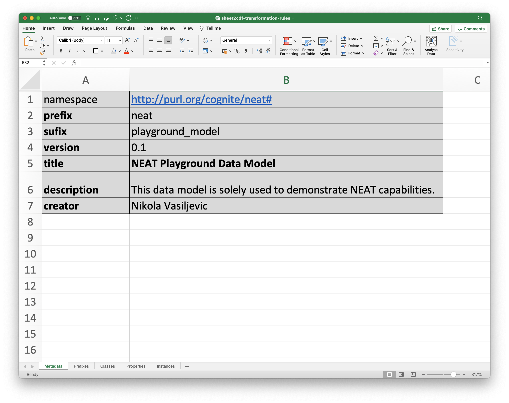

# From Excel Sheet to CDF

This workflow enables you to ingest a data model with data into CDF's core data model using the resources: assets, relationships, and labels.

**Required Capabilities**

| Capability Type | Action                                                            | Scope    | Description                                |
|-----------------|-------------------------------------------------------------------|----------|--------------------------------------------|
| Assets          | `assets:list`, `assets:read`, `assets:write`                      | Dataset  | Create and list assets                     |
| Relationships   | `relationships:list`, `relationships:write`, `relationships:read` | Dataset  | Create and list relationships              |
| Labels          | `labels:list`, `labels:write`, `labels:read`                      | Dataset  | Create and list labels used to mark assets |

**Prerequisite** Created configuration with the above capabilities, [see configuration](../../getting-started.md#configuration)


This workflow is purely based on [Transformation Rules](../../transformation-rules.md), a specially tailored Excel template,
which holds both the semantic data model and the knowledge graph definitions. The workflow is depicted in the screenshot below.


As we can see `Transformation Rules` is input to two phases of the workflow. In the first phase, `Transformation Rules` is used to
create knowledge graph through parsing. The parser output creates a source knowledge graph which is stored in `rdflib` in-memory graph database.
The source knowledge graph and `Transformation Rules` rules are then fed to the second phase of the workflow which converts
the knowledge graph to [Assets](https://docs.cognite.com/no/dev/concepts/resource_types/assets/),
[Relationships](https://docs.cognite.com/no/dev/concepts/resource_types/relationships)
and [Labels](https://docs.cognite.com/no/dev/concepts/resource_types/labels) which are then pushed to `CDF`.


## Transformation Rules
Details on what `Transformation Rules` are and how to use them can be found in the [Transformation Rules](../../transformation-rules.md) section.
Here we will go only in the details about specific information that this workflow `Transformation Rules` holds.

### Semantic Data Model Definition
From the `Metadata` sheet one can see that we are defining `neat` data model, which version 0.1 is the current version.
This data model is used as a playground, and can be freely distributed. In our case, knowledge graph,
which is the instance of the model we are defining, will be ingested into CDF under dataset `2626756768281823`,
which in this case is the part of "Grid Extension Team" CDF project. As few people are using the same project
to play with `NEAT` we are also adding prefixes to all resulting CDF assets and relationship external ids to avoid conflicts.



`shortName` attribute is used to define prefix for data model and knowledge graph `namespace` (aka URI), which is automatically generated by `NEAT` based on the template:

```
http://purl.org/cognite/{shortName}#
```


which for sake of visibility is added to the `Prefixes` sheet:


`Classes` sheet contains the definition of the classes that are part of the `neat` data model. In this case we are defining four classes:
- CountryGroup
- Country
- PriceArea
- PriceAreaConnection

None of these classes inherits properties of any other, so column `Parent Class` is empty.


In the `Properties` sheet we have definition of properties per each class that we defined in the `Classes` sheet. In this case we are defining 4 properties for each class:

contains the definition of the properties that are part of the semantic data model. This sheet contains more granular look on the semantic data model as properties are defined per each class including their cardinality and type of value they can hold. Therefore, in this sheet we are actually defining specific shape of classes.


In the screenshot above we can see that we defined for example:

- `name` property for all classes as mandatory single value property that holds values of type `string`
- `TSO` property as mandatory multi value property that holds values of type `string`
- `priceArea` property as mandatory property which hold minimum two and maximum two values of type `PriceArea` (i.e., two references to instances of `PriceArea` class)

The definitions in the sheets above are converted by `NEAT` into the semantic data model in the form of [RDF triples](https://www.oxfordsemantic.tech/fundamentals/what-is-a-triple).


### Semantic Data Model to CDF Asset Hierarchy Transformation
`Classes` and `Properties` sheets contain also columns that define how semantic data model instances (aka knowledge graph) are transformed/mapped to CDF resources specifically in this example to CDF `Assets` and `Relationships`.

First, in the `Classes` sheet we define that classes should be mapped to instances of `Assets` in CDF. Also, here we provide high level overview of `Asset Hierarchy` by stating that `PriceArea` assets will have `Country` assets as their parents. Similarly, `Country` assets will have `CountryGroup` assets as their parents.


More detailed mapping to CDF Resources is defined in the `Properties` sheet. Here particularly we state to what value of each property maps to in CDF. For example, `name` property of `CountryGroup` class is mapped to `name` attribute of CDF `Asset` resource. Also one can notice that we explicitly state how asset hiearchy is achieved by providing mapping of certain properties to `parent_external_id` attribute of CDF `Asset` resource (e.g., property `country` of `PriceArea` class is mapped to `parent_external_id` attribute of `Country` asset).


Futhermore, since we can use CDF `Relationships` to express additional relationships between assets we can express which properties are used to create them. In this example property `priceArea` of class `PriceAreaConnection` is used to create relationship between `PriceAreaConnection` as source asset and `PriceArea` as target asset (rember CDF relationships are directional), while `priceAreaConnection` is used to do the same but in opposite direction.

### Source to Solution Graph Transformation
In typical scenario we would already have knowledge graph, to which we would relate as `Source Graph` and we would perform transformations to `Solution Graph` which would be then mapped to CDF Resources. This mapping would be defined in the `Properties` sheet of the `Transformation Rules` file, as one can see below:


However, in this case, we are defining knowledge graph from scratch, so we are defining `Source Graph` and `Solution Graph` at the same time. In this case `Source Graph` is the same as `Solution Graph` and it is defined in the `Instances` sheet (see section below). Accordingly our mapping rules define 1-1 mapping between source and solution graph and they are only defined since `NEAT` expects to have them, otherwise validation of the input `Transformation Rules` file will fail. Future versions of `NEAT` will allow to submit `Transformation Rules` file without source-to-solution mapping rules.

### Semantic Data Model Instances Definition
In this simple example we are actually using `Instances` sheet to define small knowledge graph. In total we define 13 instances of which:

- 6 are instances of `PriceAreaConnection` class
- 5 are instances of `PriceArea` class
- 1 is instance of `CountryGroup` class
- 1 is instance of `Country` class


## Running the Workflow
This is relatively simple workflow that consists of 10 steps and it is triggered through UI (thus Http trigger in screenshot below). These steps are:
- Loading of transformation rules
- Configuration of in memory knowledge graph store
- Parsing of instance triples
- Loading of instances to source graph
- Creation of CDF labels from transformation rules
- Creation of CDF assets from source graph based on transformation rules
- Uploading of CDF assets to CDF
- Creation of CDF relationships from source graph based on transformation rules
- Uploading of CDF relationships to CDF
- Post cleanup


Before starting this workflow we need to upload `Transformation Rules` which done through `Transformation Rules` part of UI:


Upon successful upload of `Transformation Rules` we get more compound view of them in the UI:


Afterward, we can trigger the workflow :


The result of the workflow execution is the following CDF Asset Hierarchy:


which in total contains 14 assets (one extra for Orphanage) and 24 relationships.
