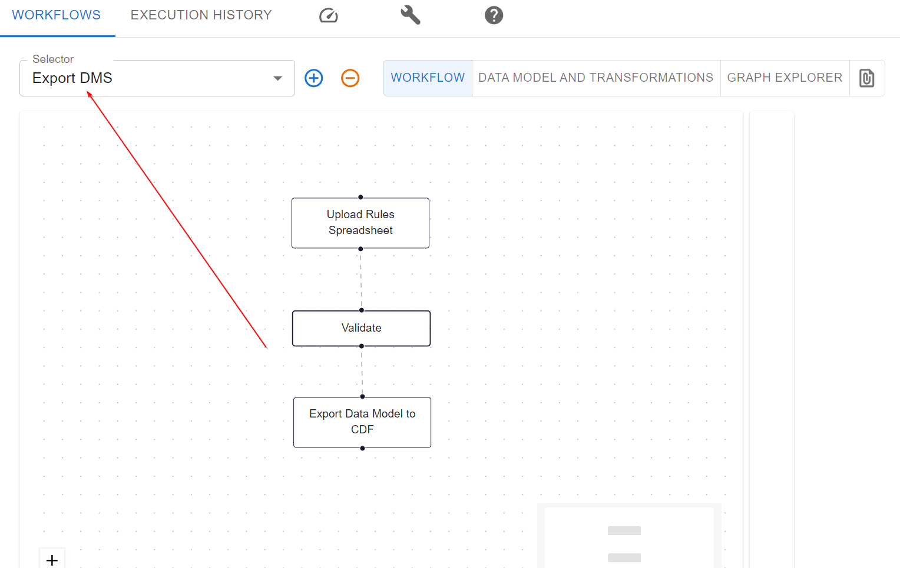
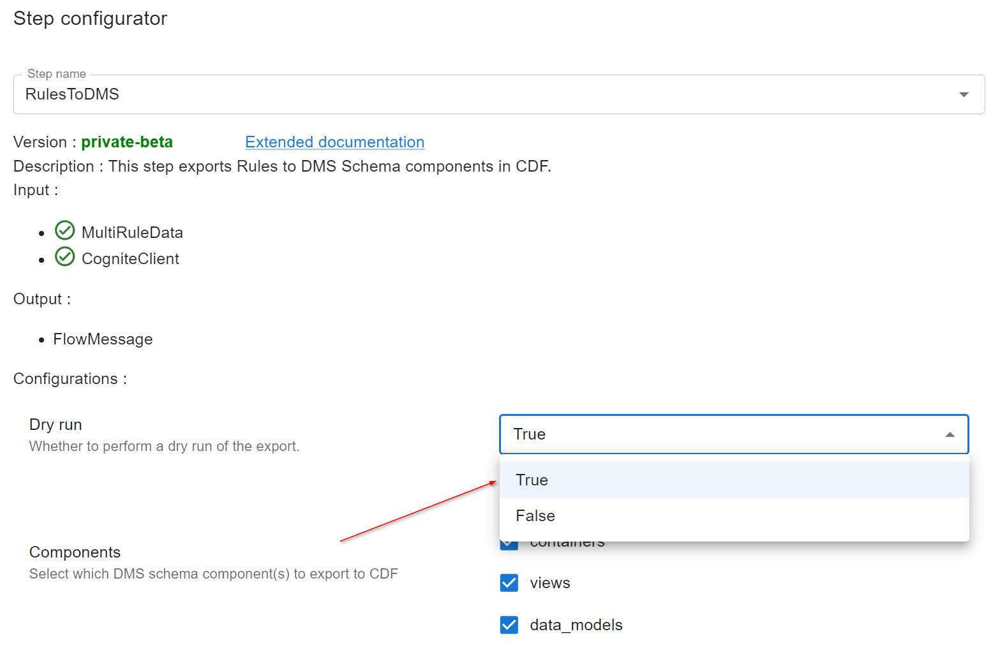
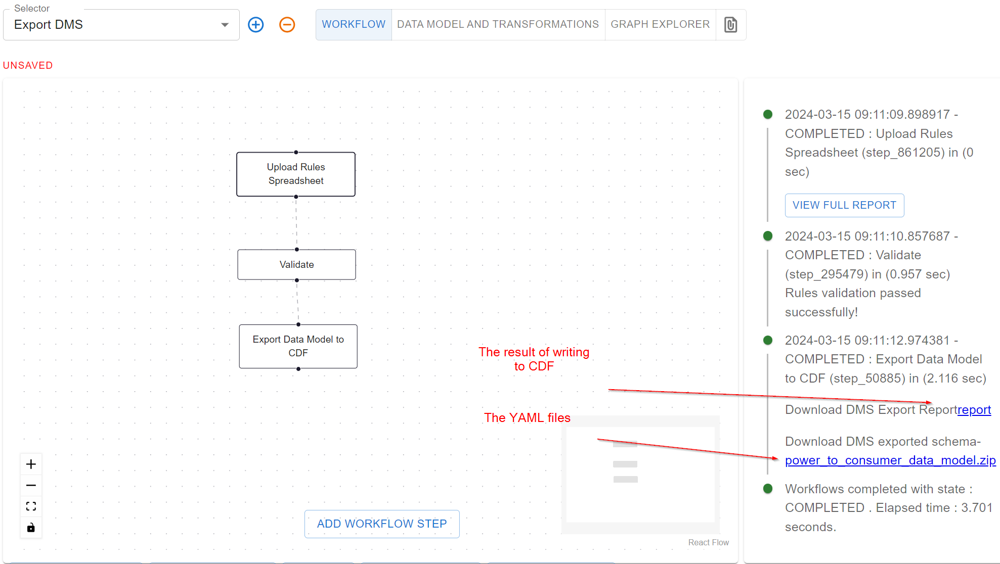

# Data Modeling Lifecycle through Expert Elicitation: Building an Enterprise Data Model

!!! warning annotate "Warning"
    This tutorial is a work in progress and is not yet complete.

This tutorial demonstrates the usage of `neat` through out the entire data modeling lifecycle producing an Enterprise Data Model in Cognite Data Fusion (CDF).
The data modeling lifecycle is based on the so-called [Expert Elicitation](https://en.wikipedia.org/wiki/Expert_elicitation), and represents the recommended way of building enterprise data models.


## Introduction

Companies typically have multiple domain experts that working in different business units. Typically, these
units are partially overlapping, both in concepts and data. Lots of the value in a product like CDF comes from
taking data from different sources and making them easily accessible and understandable for all domain experts and all business units, as
this unlocks the potential for cross-domain insights.

The expert elicitation is the process of distilling the domain expert knowledge and turning it into a shared knowledge artifact such as an Enterprise Data Model (covering the entire suite of use-cases and domains and business units).
`neat` has been designed to facilitate this process by providing a way to iterate on and developed the enterprise data model.

## Use Case

In this tutorial, we will focus on the Power & Utilities industry and try to build power to consumer data model.
We will have two domain experts, one that focuses on wind farm operation and one that focuses on electrical grid, lets call them Jon and Emma.
In addition, we will have an information architect, let's call him David, who will be responsible for combining the
knowledge from Jon and Emma into an enterprise data model. Finally, we have a CDF expert, let's call her Alice,
who will be responsible for implementing the enterprise data model in CDF. Note that in a real-world scenario,
the information architect and the CDF solution architect (DMS - domain model service architect) might be the same
person, but for the purpose of this tutorial, we will keep these roles separate to highlight required skills necessary for each role
as well to highlight how their use of `neat` will be different.

**Note** You don't need to be an expert in the Power & Utilities industry to follow this tutorial. The concepts
are generic and can be applied to any industry in which you have domain experts with overlapping knowledge and data.
We have purposely simplified the domains to make it easier to follow this tutorial.

## Wind Farm Operation Expert: Jon

### Gathering Knowledge
In `neat`, knowledge is captured in statements (i.e. sentences). A statement is a simple fact about a thing (e.g. wind turbine). In this tutorial, we will collect statements that describe the properties of physical objects that constitute an operational wind farm connected to an electrical grid. We purposely use spreadsheets to
collect these statements due to their inclusive nature (anyone knows how to use them). This is important, as we want to enable collaborative data modeling experience among domain experts, information architect and CDF experts.


We will start with a wind turbine. For example, Jon might say that a wind turbine has a `name`, a `location`, `manufacturer`, `ratedPower`, `hubHeight`, `actualPower` and `arrayCableConnection`. These are all statements. In `neat`, we capture these statements in a spreadsheet format. We refer to a set of
statements as `Properties`. The `Properties` sheet looks as follows for a domain expert like Jon:

| Class       | Property           | Description     | Value Type  | Min Count  | Max Count  |
|-------------|--------------------|-----------------|-------------|------------|------------|
| WindTurbine | name               |                 | string      | 1          | 1          |
| WindTurbine | location           |                 | string      | 0          | 1          |
| WindTurbine | manufacturer       |                 | string      | 0          | 1          |
| WindTurbine | lifeExpectancy     |                 | integer     | 1          | 1          |
| WindTurbine | ratedPower         |                 | float       | 1          | 1          |
| WindTurbine | hubHeight          |                 | float       | 1          | 1          |
| WindTurbine | actualPower        |                 | timeseries  | 1          | 1          |
| WindTurbine | arrayCableConnection |               | integer     | 1          | 1          |
| WindFarm    | name               |                 | string      | 1          | 1          |
| WindFarm    | location           |                 | string      | 0          | 1          |
| WindFarm    | windTurbine        |                 | WindTurbine | 1          | Inf        |
| Substation  | inputVoltage       |                 | timeseries  | 1          | 1          |
| Substation  | outputVoltage      |                 | timeseries  | 1          | 1          |
| ExportCable | voltageLevel       |                 | float       | 1          | 1          |
| ExportCable | currentVoltage     |                 | timeseries  | 1          | 1          |

In each row of the `Properties` sheet, Jon will define a statement. For example, the first row says that a
`WindTurbine` has a `name`. In addition, Jon can add a `description`, i.e., a human-readable explanation of what a particular property means. The three next columns help the information architect, David, to understand how to model the data. First, we have the
`Value Type` column, which specify what type of data this statement is about. Is this a number, an on/off value, text,
or something else? In this case, the `name`, `location`, and `manufacturer` are all strings, meaning they are
expected to be text. The `Min Count` and `Max Count` columns specify how many data points are expected for each of these properties. In the
first row, we see that a `WindTurbine` is expected to have exactly one `name`. Sames goes for the `location` and `manufacturer`. However, for `lifeExpectancy`, we see that it is optional, as the `Min Count` is 0. Also, `lifeExpectancy` is an integer, as it is expected to be a whole number.

<a id="value-type-anchor"></a>
!!! warning annotate "Value Types"
    The `Value Type` column is used to specify the type of the value that the property can hold. It takes either XSD type (`float`, `boolean`, `string`, etc) extended with additional types (`timeseries`, `file`, `sequence` and `json`) or a class defined in the `Classes` sheet (complex types).


In the similar fashion, Jon defines the properties for `WindFarm`, `Substation` and `ExportCable` in the `Properties` sheet.

In addition to the `Properties` sheet, `neat` also requires `Metadata` sheet as well.
In case of domain expert the `Metadata` sheet only requires `role` and `creator` to be set, where `role` represent the role a person has in modeling of the enterprise data model and `creator` is the name of the person from whom we are acquiring knowledge to create the model.
For Jon the `Metadata` sheet looks as follows:

|         |               |
|---------|---------------|
| role    | domain expert |
| creator | Jon           |


Optionally, domain experts can also define classes in the `classes` sheet. Classes are used to group properties that define a thing (e.g., a real-life object). For example, a `WindTurbine` is a class, and the set of properties for a class defines what it means to be a member of that class. However, as it is optional, Jon skips this sheet, and leaves it to the information architect, David, to define that for him.

Download Jon's spreadsheet from [here](../../artifacts/rules/expert-wind-energy-jon.xlsx).


### Validating Statements in Neat
When Jon has defined all the statements, he can validate the sheet using `neat`. This will check that all the
statements are correctly defined and that there are no inconsistencies. For example, that all properties
are using valid characters in their names.

To validate his sheet, Jon opens the `neat` UI and selects the `Validate Rules` workflow, uploads his sheet, which will trigger the validation process. The validation process will output a report with any errors and warnings. Jon can then go back to his sheet and fix any issues that are reported. See the video below for a step-by-step guide on how to validate a sheet in `neat`:

<iframe width="840" height="472" src="https://www.youtube.com/embed/G2g_90qjcIU?si=V3q_umDrFrPtJRKo" title="Rules Validation Workflow" frameborder="0" allow="accelerometer; autoplay; clipboard-write; encrypted-media; gyroscope; picture-in-picture; web-share" allowfullscreen></iframe>


### Summary

**Domain Expert Task.**

1. (Required) Gathering statements in a spreadsheet.
2. (Optional) Defining classes in a spreadsheet.

**Domain Expert usage of `neat`**:

1. Validate the sheet using the `neat` UI.


## Grid Analysis Expert: Emma

### Gathering Knowledge
Similarly to Jon, Emma will define a set of statements in a spreadsheet. As being more meticulous and keen to go one step further she will also fill in `Classes` sheet. Like in case of Jon, she starts with `Properties` sheet. She defines some similar statements as Jon, but also adds completely new ones. This is expected as there are overlaps between in our case the power production and power transmission domains.

For example, she defines
`Substation` has a `name`, a `location`, and a `voltage`. In addition, she might define that a `Substation` has
a `transformer` and a `circuit breaker`, and she has also adds a `GeneratingUnit` that has a `name` and `activePower`.
The `Properties` sheet for Emma might look as follows:

| Class         | Property                 | Description | Value Type           | Min Count | Max Count |
|---------------|--------------------------| ----------- |----------------------|-----------|-----------|
| GeneratingUnit| name                     |             | string               | 1         | 1         |
| GeneratingUnit| type                     |             | string               | 1         | 1         |
| GeneratingUnit| activePower              |             | float                | 1         | 1         |
| Substation    | name                     |             | string               | 1         | 1         |
| Substation    | location                 |             | string               | 0         | 1         |
| Substation    | disconnectSwitch         |             | DisconnectSwitch     | 2         | 2         |
| Substation    | circuitBreaker           |             | CircuitBreaker       | 2         | 2         |
| Substation    | currentTransformer       |             | CurrentTransformer   | 2         | 2         |
| Substation    | mainTransformer          |             | VoltageTransformer   | 1         | 1         |
| Transmission  | name                     |             | string               | 1         | 1         |
| Transmission  | location                 |             | string               | 0         | 1         |
| Transmission  | voltage                  |             | number               | 1         | 1         |
| Transmission  | substation               |             | Substation           | 1         | 1         |
| Distribution  | name                     |             | string               | 1         | 1         |
| Distribution  | location                 |             | string               | 0         | 1         |
| Distribution  | voltage                  |             | number               | 1         | 1         |
| Distribution  | substation               |             | Substation           | 1         | 1         |
| Consumer      | name                     |             | string               | 1         | 1         |
| Consumer      | location                 |             | string               | 0         | 1         |
| Consumer      | load                     |             | number               | 1         | 1         |
| Consumer      | type                     |             | string               | 1         | 1         |


As mentioned earlier, Emma also abstracts classes from `Properties` sheet and puts them in `Classes` sheet to have a better overview of her domain, de-cluttered from properties. To differentiate between `CurrentTransformer` and `VoltageTransformer` she also adds a `Parent Class` column to the `Classes` sheet, indicating that these two classes are indeed a specialization of `Transformer`. The `Classes` sheet for Emma might look as follows:


| Class              | Description                                         | Parent Class       |
|--------------------|-----------------------------------------------------|--------------------|
| Substation         | A part of an electrical grid                        |                    |
| Transformer        | A device that changes electrical voltage or current |                    |
| CurrentTransformer | A device that changes electrical voltage or current | Transformer        |
| VoltageTransformer | A device that changes electrical voltage or current | Transformer        |
| CircuitBreaker     | A device that can stop the flow of electricity      |                    |
| DisconnectSwitch   | A device that can stop the flow of electricity      |                    |
| GeneratingUnit     | A device that generates electrical energy           |                    |
| Transmission       | A part of an electrical grid                        |                    |
| Distribution       | A part of an electrical grid                        |                    |
| Consumer           | A part of an electrical grid                        |                    |


Like in the case of Jon, Emma also fills in the `Metadata` sheet. For Emma the `Metadata` sheet looks as follows:

|         |               |
|---------|---------------|
| role    | domain expert |
| creator | Emma          |


You can find the complete `Properties`, `classes`, and `metadata` sheets for Emma here.

Finally, Emma will validate her sheet using the `neat` UI, just like Jon did.

Download Emma's spreadsheet from [here](../../artifacts/rules/expert-grid-emma.xlsx).

### Summary

**Domain Expert Task.**

1. (Required) Gathering statements in a spreadsheet.
2. (Optional) Defining classes in a spreadsheet.

**Domain Expert usage of `neat`**:

1. Validate the sheet using the `neat` UI.


## Information Architect: David

### Creating the Shared Data Model

Once Jon and Emma have defined their statements, David will combine the two sheets into a single sheet. This is
done by copying the statements from Jon and Emma into a single sheet and making a tough decision on how to combine them to produce the enterprise data model. For example, if Jon and Emma have defined the same property in different ways, David will have to decide which definition to use. In certain situations additional classes and properties will have to be added to connect two domains. This is a trade-off, as he might have to prompt Jon and Emma for clarification, or he might have to make a decision based on his own knowledge.


Let start with `Classes` sheet and investigate outcome of merging Jon's and Emma's classes:

| Class                  | Description | Parent Class           | Reference                                            | Match Type |
|------------------------|-------------|------------------------|------------------------------------------------------|------------|
| GeneratingUnit         |             |                        | http://www.iec.ch/TC57/CIM#GeneratingUnit            | exact      |
| WindTurbine            |             | GeneratingUnit         | http://purl.org/neat/WindTurbine                     | exact      |
| EnergyArea             |             |                        | http://www.iec.ch/TC57/CIM#EnergyArea                |            |
| WindFarm               |             | EnergyArea             | http://purl.org/neat/WindFarm                        | partial    |
| Substation             |             |                        |                                                      |            |
| OffshoreSubstation     |             | Substation             |                                                      |            |
| TransmissionSubstation |             | Substation             |                                                      |            |
| DistributionSubstation |             | Substation             |                                                      |            |
| OnshoreSubstation      |             | TransmissionSubstation |                                                      |            |
| PowerLine              |             |                        |                                                      |            |
| ArrayCable             |             | PowerLine              |                                                      |            |
| ExportCable            |             | PowerLine              |                                                      |            |
| Transmission           |             | PowerLine              | http://www.iec.ch/TC57/CIM#ACLineSegment             |            |
| DistributionLine       |             | PowerLine              |                                                      |            |
| Meter                  |             |                        |                                                      |            |
| EnergyConsumer         |             |                        | http://www.iec.ch/TC57/CIM#EnergyConsumer            |            |
| ElectricCarCharger     |             | EnergyConsumer         |                                                      |            |
| GeoLocation            |             |                        | http://www.w3.org/2003/01/geo/wgs84_pos#SpatialThing |            |
| Point                  |             | GeoLocation            | https://purl.org/geojson/vocab#Point                 |            |
| MultiLineString        |             | GeoLocation            | https://purl.org/geojson/vocab#MultiLineString       |            |
| Polygon                |             | GeoLocation            | https://purl.org/geojson/vocab#Polygon               |            |
| CircuitBreaker         |             |                        |                                                      |            |
| CurrentTransformer     |             |                        |                                                      |            |
| DisconnectSwitch       |             |                        |                                                      |            |
| VoltageLevel           |             |                        |                                                      |            |
| VoltageTransformer     |             |                        |                                                      |            |


There are couple of things that David done. First of all, he use principle of sub-classing to create a class specialization in order to satisfy both Jon's and Emma's definitions. For example, he created a `WindTurbine` class that is a subclass of `GeneratingUnit`. This is done by adding a `Parent Class` column to the `Classes` sheet. By doing this, he enable adding additional types of generating units in the future. In the same fashion, he also created a `WindFarm` class that is a subclass of `EnergyArea`, basically connecting the two domains and allowing for other types of energy areas to be defined in the future. We see the similar approach with `Substation`, `Transmission`, `EnergyConsumer`, and `Point`. By sub-classing we enable the possibility to inherit properties from the parent class, avoiding the need to define the same properties for each subclass, which we will see in the `Properties` sheet.

In addition, David also added a `Reference` and `Match Type` columns to the `Classes` sheet. The `Reference` column is used to specify where the statement comes from, or what standard that matches the statement. The `Match Type` column tells whether the source is partially or fully matching the statement. We see that David did a great work linking the enterprise data model to existing standards, such as the CIM standard for energy areas and energy consumers. This is a good practice, as it sets the knowledge into a broader context, allowing for easier integration with other systems and standards. In other words, David did not fall into a trap of reinventing the wheel, but rather leveraged existing standards to define the enterprise data model (what a smart guy!).


Let's now move to the `Properties` sheet. David will also combined and uplifted the `Properties` sheets from Jon and Emma:


| Class                  | Property             | Description | Value Type         | Min Count | Max Count | Reference                                        | Match Type |
|------------------------|----------------------|-------------|--------------------|-----------|-----------|--------------------------------------------------|------------|
| GeneratingUnit         | name                 |             | string             |         1 |         1 |                                                  |            |
| GeneratingUnit         | type                 |             | string             |         1 |         1 |                                                  |            |
| GeneratingUnit         | activePower          |             | timeseries         |         1 |         1 |                                                  |            |
| GeneratingUnit         | geoLocation          |             | Point              |         1 |         1 | http://www.w3.org/2003/01/geo/wgs84_pos#location | exact      |
| WindTurbine            | manufacturer         |             | string             |         0 |         1 |                                                  |            |
| WindTurbine            | ratedPower           |             | float              |         1 |         1 |                                                  |            |
| WindTurbine            | hubHeight            |             | float              |         1 |         1 |                                                  |            |
| WindTurbine            | arrayCableConnection |             | ArrayCable         |         1 |         1 |                                                  |            |
| WindTurbine            | lifeExpectancy       |             | integer            |         0 |         1 |                                                  |            |
| EnergyArea             | name                 |             | string             |         1 |         1 |                                                  |            |
| EnergyArea             | geoLocation          |             | Polygon            |         0 |         1 |                                                  |            |
| EnergyArea             | ratedPower           |             | float              |         1 |         1 |                                                  |            |
| EnergyArea             | activePower          |             | timeseries         |         1 |         1 |                                                  |            |
| WindFarm               | windTurbines         |             | WindTurbine        |         1 | Inf       |                                                  |            |
| WindFarm               | substation           |             | OffshoreSubstation |         1 |         1 |                                                  |            |
| WindFarm               | arrayCable           |             | ArrayCable         |         1 | inf       |                                                  |            |
| WindFarm               | exportCable          |             | ExportCable        |         1 |         1 |                                                  |            |
| PowerLine              | voltageLevel         |             | VoltageLevel       |         1 |         1 |                                                  |            |
| PowerLine              | geoLocation          |             | MultiLineString    |         1 |         1 |                                                  |            |
| PowerLine              | currentVoltage       |             | timeseries         |         1 |         1 |                                                  |            |
| PowerLine              | length               |             | float              |         0 |         1 |                                                  |            |
| Substation             | name                 |             | string             |         1 |         1 |                                                  |            |
| Substation             | location             |             | string             |         0 |         1 |                                                  |            |
| Substation             | disconnectSwitch     |             | DisconnectSwitch   |         2 |         2 |                                                  |            |
| Substation             | circuitBreaker       |             | CircuitBreaker     |         2 |         2 |                                                  |            |
| Substation             | currentTransformer   |             | CurrentTransformer |         2 |         2 |                                                  |            |
| Substation             | mainTransformer      |             | VoltageTransformer |         1 |         1 |                                                  |            |
| Substation             | primaryPowerLine     |             | PowerLine          |         1 |         1 |                                                  |            |
| Substation             | secondaryPowerLine   |             | PowerLine          |         1 |         1 |                                                  |            |
| Substation             | primaryVoltage       |             | timeseries         |         1 |         1 |                                                  |            |
| Substation             | secondaryVoltage     |             | timeseries         |         1 |         1 |                                                  |            |
| OffshoreSubstation     | primaryPowerLine     |             | ArrayCable         |         1 | inf       |                                                  |            |
| OffshoreSubstation     | secondaryPowerLine   |             | ExportCable        |         1 |         1 |                                                  |            |
| OnshoreSubstation      | primaryPowerLine     |             | ExportCable        |         1 |         1 |                                                  |            |
| OnshoreSubstation      | secondaryPowerLine   |             | Transmission       |         1 |         1 |                                                  |            |
| DistributionSubstation | primaryPowerLine     |             | Transmission       |         1 |         1 |                                                  |            |
| DistributionSubstation | secondaryPowerLine   |             | DistributionLine   |         1 |       inf |                                                  |            |
| Meter                  | powerLine            |             | DistributionLine   |         1 |         1 |                                                  |            |
| Meter                  | consumer             |             | ElectricCarCharger |         1 |       inf |                                                  |            |
| Meter                  | consumption          |             | timeseries         |         1 |         1 |                                                  |            |
| EnergyConsumer         | name                 |             | string             |         1 |         1 |                                                  |            |
| EnergyConsumer         | location             |             | Point              |         1 |         1 |                                                  |            |
| EnergyConsumer         | load                 |             | timeseries         |         1 |         1 |                                                  |            |
| GeoLocation            | name                 |             | string             |         1 |         1 |                                                  |            |
| Point                  | latitude             |             | float              |         1 |         1 |                                                  |            |
| Point                  | longitude            |             | float              |         1 |         1 |                                                  |            |
| MultiLineString        | point                |             | Point              |         2 |       inf |                                                  |            |
| Polygon                | point                |             | Point              |         3 |       inf |                                                  |            |
| CurrentTransformer     | maxCapacity          |             | float              | 0         | 1         |                                                  |            |
| VoltageTransformer     | outputVoltageLevel   |             | VoltageLevel       | 1         | 1         |                                                  |            |
| VoltageTransformer     | inputVoltageLevel    |             | VoltageLevel       | 1         | 1         |                                                  |            |
| VoltageLevel           | maxLevel             |             | float              |         1 |         1 |                                                  |            |
| CircuitBreaker         | maxCapacity          |             | float              |         0 |         1 |                                                  |            |
| DisconnectSwitch       | maxCapacity          |             | float              |         0 |         1 |                                                  |            |


Observe that we are using same range of value types as in case for [domain experts](#value-type-anchor).

Here we see how inheritance and proper modeling of classes pays off. Instead of repeating properties from `GeneratingUnit` for `WindTurbine`, David only needs to define the properties specific only to `WindTurbine`. This is because `WindTurbine` is a subclass of `GeneratingUnit`, and thus inherits all the properties from `GeneratingUnit`. This is a good practice, as it reduces the amount of work needed to define the enterprise data model. In addition, it also makes the enterprise data model more consistent, as the same properties are used for similar things.


Let's now have a look at statements for `OffshoreSubstation`, in `Classes` sheet David stated that `OffshoreSubstation` is a subclass of `Substation`, and in `Properties` sheet he only needs specialized type of values two properties take in order to make this class a specific subclass of `Substation`. This is a good example of how inheritance can be used to reduce the amount of work needed to define the enterprise data model. Similar like in the case of `Classes` sheet David also added a `Reference` and `Match Type` columns to link the enterprise data model to existing standards, in this case to definition of properties coming from different standards.


In addition, David will needs to update a `metadata` sheet, he is adding :

- `namespace` : a globally unique identifier for the enterprise data model
- `prefix` : a short name that can be used to reference the namespace in various downstream systems
- `create` : a date when the enterprise data model was created
- `schema` : a indication of schema completeness, which can be either one of the following:
    -  `complete` - the data model is entirely defined in the spreadsheets
    -  `partial` - the data model is defined within several spreadsheets
    -  `extended` - data model is defined in spreadsheets and external sources (ontology, CDF, etc.)
- `updated` : a date when the enterprise data model was last updated
- `version` : a version of the enterprise data model
- `title` : a title of the enterprise data model
- `description` : a human-readable explanation of what the enterprise data model is about
- `license` : a license of the enterprise data model, basically in what way it can be used
- `rights` : rights of the enterprise data model, basically who has the right to use it

He is adding him self as a co-creator as well. The `metadata` sheet for David might look as follows:

|             |                                        |
|-------------|----------------------------------------|
| role        | information architect                  |
| creator     | Jon, Emma, David                       |
| namespace   | http://purl.org/cognite/power2consumer |
| prefix      | power                                  |
| schema      | complete                               |
| created     | 2024-01-22                             |
| updated     | 2024-02-09                             |
| version     | 0.1.0                                  |
| title       | Power to Consumer Data Model           |
| description | end2end power to consumer data model...|
| license     | CC-BY 4.0                              |
| rights      | Free for use                           |


The enterprise data model is now ready to be validated in `neat`. David will validate his sheet using the `neat` UI, just like Jon and Emma did. However, since David has set his role as `information architect` in the `metadata` sheet, the validation from `neat` will be more strict. For example, while Jon and Emma can skip defining anything in the `class` sheet, David will have to ensure all classes are defined. Also, there is more demand when comes to `metadata`.

Nevertheless, this hard work pays off since the enterprise data model can be now used to digitally represent the entire power to consumer domain in the form of rich knowledge graph empowering services from various domains.


### Visualize Semantic Data Model
Due to additional information that David as an information architect has added to the enterprise data model,
David can exported Rules as semantic data model which consists of:

- Ontology presented as a set of RDF triples using [OWL](https://www.w3.org/OWL/) standard
- Shape object constraints presented as a set of RDF triples using [SHACl](https://www.w3.org/TR/shacl/) standard

The derived data model can be exported as so-called Turtle file, which is a standard way to represent RDF data.
This file can be used in any ontology tool, such as [Protégé](https://protege.stanford.edu/), while combination of
both OWL and SHACL can be used to in a tool such as [SHACL Play!](https://shacl-play.sparna.fr/play/).

For purpose of this demonstration David will actually use `neat` to load generated semantic data model into
internal RDF store and visualize it using `neat` UI. To do this, David selects `Visualize Semantic Data Model` workflow
which unlike the previous is a bit more demanding as it requires configuration of additional steps, specifically:

- `RulesToSemanticDataModel` : which will convert `Rules` into semantic data model and store it as a Turtle file
- `GraphStoreConfiguration`: which will configure the internal RDF store
- `GraphFromRdfFile` : which will load the semantic data model (the Turtle file) into the internal RDF store

The process of configuration and execution of these steps is shown in the video below:

<iframe width="840" height="472" src="https://www.youtube.com/embed/_iTQatLBpns?si=CM8mcFsd9NlGZCGi" title="Semantic Data Model Generation and Visualization" frameborder="0" allow="accelerometer; autoplay; clipboard-write; encrypted-media; gyroscope; picture-in-picture; web-share" allowfullscreen></iframe>


David is using following styling of nodes and edges to make the visualization more readable in neat,
which he copy/paste under `Node Style Editor` in `Graph Explorer`:

```JSON
{
  "Class": {
    "color": "#FF5733",
    "size": 5
  },
  "NodeShape": {
    "color": "#33FF57",
    "size": 5
  },
  "ObjectProperty": {
    "color": "#3357FF",
    "size": 5
  },
  "DatatypeProperty": {
    "color": "#F3FF33",
    "size": 5
  },
  "Ontology": {
    "color": "#FF33F6",
    "size": 5
  }
}
```

### Visualize Data Model through Mock Graph
To fully comprehend semantic data mode, one needs to understand basic semantic concepts.
But `neat` offer alternative way of visualizing the semantic data model, which is through
generation of mock graph based on the data model described in spreadsheets, and optionally
desired number of instances per class defined in the data model.

David selects `Visualize Data Model Using Mock Graph` which has been configured to create
following mock graph, which is part `Generate Mock Graph` step:

```JSON
{"WindTurbine" : 10,
"WindFarm" : 1,
"OffshoreSubstation" : 1,
"DistributionSubstation" : 1,
"OnshoreSubstation" : 1,
"ArrayCable" : 1,
"ExportCable" : 1,
"Transmission" : 1,
"DistributionLine" : 1,
"Meter" : 1,
"ElectricCarCharger" : 1}
```

David uses following style to color nodes in `Graph Explorer`:


```JSON
{"WindTurbine":{"color":"#FF0000","size":5},"WindFarm":{"color":"#00FF00","size":5},"OffshoreSubstation":{"color":"#0000FF","size":5},"TransmissionSubstation":{"color":"#FFFF00","size":5},"DistributionSubstation":{"color":"#00FFFF","size":5},"OnshoreSubstation":{"color":"#FF00FF","size":5},"ArrayCable":{"color":"#C0C0C0","size":5},"ExportCable":{"color":"#808080","size":5},"Transmission":{"color":"#800000","size":5},"DistributionLine":{"color":"#808000","size":5},"Meter":{"color":"#008080","size":5},"ElectricCarCharger":{"color":"#800080","size":5}}
```

The whole process of running this workflow is shown in the video below:

<iframe width="840" height="472" src="https://www.youtube.com/embed/D98AaPW_FXI?si=M3aVCj1bhvjXXWCf" title="Visualize data model using mock graph" frameborder="0" allow="accelerometer; autoplay; clipboard-write; encrypted-media; gyroscope; picture-in-picture; web-share" allowfullscreen></iframe>


### Summary

**Information Architect Task.**

1. Add statements that connect concepts from different domain experts.
2. Add metadata to the sheet.
3. Add source column to the `Properties` sheet.
4. Add `Match Type` column to the `Properties` sheet.
5. Find overlapping concepts and prompt domain experts for clarification.
6. Add all classes to the `classes` sheet.

**Information Architect usage of `neat`**:

1. Validate the sheet using the `neat` UI.
2. Visualize the sheet using the `neat` UI.
3. Export the ontology to an open standard format (e.g., OWL, SHACL, RDF).


## DMS Architect: Alice

### Implementing the Enterprise Data Model in CDF
Once David has defined the enterprise data model, Alice will implement it in CDF. The focus of Alice is to make sure
that the enterprise data model is implemented in CDF in a way that accounts for the expected usage of the data. For example, she
needs to define how the data is stored and what properties are indexed for fast queries. In addition, she decides
which dependencies between data should be enforced. This is a trade-off in that being very strict on the data
makes it easy to use as it is predictable. However, it can be hard to populate it as large quantities of the
data might not be in the expected format. On the other hand, being very flexible on the data puts a higher burden
on the developers/users that use the data.

Her tasks can be divided into **performance** and **quality** and summarized as follows:

1. **Performance**:
   - Which indexes to create?
   - The size of the containers.
   - Implement relationships as edges or direct relations.
2. **Quality**:
   - Define constraints between containers
   - Define constraints between properties
   - Define uniqueness constraints on properties
   - Decide which properties should be mandatory.
   - Decide value types for properties (for example int32 vs int64).

For details on designing of containers see [here](https://docs.cognite.com/cdf/dm/dm_guides/dm_best_practices_containers).

### Changing the <code>metadata</code> Sheet

Alice has to modify the `metadata` sheet to include the CDF specific information.

|             |                              |
|-------------|------------------------------|
| role        | dms architect                |
| schema      | complete                     |
| space       | sp_power                     |
| name        | Power to Consumer Data Model |
| description |                              |
| externalId  | power_enterprise_model       |
| version     | 1                            |
| creator     | Jon, Emma, David, Alice      |
| created     | 2021-01-01                   |
| updated     | 2021-01-01                   |

First, she adds herself as a creator, and then she adds the `space` and `externalId` columns. The `space`
column is used to define the space in CDF where the data model should be loaded. The `externalId` column is used
to define the external id of the enterprise data model. This is used to reference the data model from other parts of CDF.
Note that if Alice got a sheet converted from David using the `To DMS Rules` workflow, thes `space` and `externalId`
will be automatically filled out.

### The <code>properties</code> Sheet

Using the workflow `To DMS Rules`, Alice will convert the `properties` sheet to a DMS format. This will add
nine new columns as well as modify the `Value Type` column. The first row of the `properties` sheet for Alice
might look as follows:

| Class         | Property         | ValueType | Relation | Nullable | IsList | Container  | Container Property | Index | Constraints | View        | View Property |
|---------------|------------------|-----------|----------|----------|--------|------------|--------------------|-------|-------------|-------------|---------------|
| WindTurbine   | name             | Text      |          | False    | False  | PowerAsset | name               | name  |             | WindTurbine | name          |

`neat` will fill out all the new columns with suggested values, but Alice can modify them as she sees fit and thus
she has granular control over how the data should be stored in CDF.

The columns are as follows:

#### How to store the properties in CDF

* **Value Type**: The values in the Value Type columns are converted to the types supported by DMS. For example, the
  `string` type is converted to `Text`. Alice must still check and potentially modify the value types to ensure
  that they are correct. For example, `float` are converted to `float64`, and Alice might decide to change it to
  `float32` if she knows that the values will never be larger than 32 bits.
* **Relation**: This columns only applies to relationships between entities. It is used to specify how the relationship
  should be implemented in CDF. For example, if the relationship should be implemented as an edge or as a direct
  relation.
* **Nullable**: This only applies to primitive types. This column is used to specify whether the property is
  required or not. For example, Alice might decide that the `name` property of a `WindTurbine` is required,
  and she will set the `Nullable` column to `False`.
* **IsList**: This only applies to primitive types. This column is used to specify whether the property is a list or not.
  For example, say a `WindTurbine` can have multiple timeseries measuring the temperature, Alice might have a property
  called `temperature` that is a list of Timeseries, which means she will set `Value Type` to `TimeSeries` and
  `IsList` to `True`.

#### Where to store the properties in CDF

* **Container**: This column is used to specify which container the data should be stored in. For example, Alice might
  decide that the `WindTurbine` data should be stored in a container called `PowerAsset`.
* **Container Property**: This column is used to specify which property in the container that the data should be
  stored in. For example, Alice might decide that the `WindTurbine` data should be stored in a property called `name`
  in the `PowerAsset` container.
* **Index**: This column is used to specify whether the property should be part of an index. For example, Alice might
  decide that the `name` property of a `WindTurbine` should be part of an index, and she will set the `Index` column
  to `name`.
* **Constraints**: This column is used to specify constraints. For example, Alice might decide that the `name`
  property of a `WindTurbine` should be unique, so she will set the `Constraints` column to `unique`. If the property
  is a relation implemented as a direct relation, Alice can also specify that the source (other end of the relation)
  should be in a specific container.

#### How to consume the properties in CDF
* **View**: This column is used to specify which view the property should be part of. For example, Alice might decide
  that the `name` property of a `WindTurbine` should be part of a view called `WindTurbine`.
* **View Property**: This column is used to specify what the property should be called in the view.

### The <code>Container</code> Sheet

The output of the `To DMS Rules` will produce two new sheets `Container` and `View`. The `Container` sheet is used
to define constraints between the containers. The first three rows of the `Container` sheet for Alice look
as follows:

| Class          | Container      | Description | Constraint     |
|----------------|----------------|-------------|----------------|
| PowerAsset     | PowerAsset     |             |                |
| GeneratingUnit | GeneratingUnit |             | PowerAsset     |
| WindTurbine    | WindTurbine    |             | GeneratingUnit |


Interpreting the first three rows, we see that all entries in the `GeneratingUnit` container must have a corresponding
entry in the `PowerAsset` container. In addition, all entries in the `WindTurbine` container must have a corresponding
entry in the `GeneratingUnit` container (and thus also the `PowerAsset` container. Note that the first column of the
container sheet is the `Class`. This is not used when exporting the data model to CDF, but it is kept to make it
clear how the containers are related to the classes in the Information Sheet from David.

### The <code>View</code> Sheet

The `View` sheet is used to define which views implements other views. Implements means that a view is reusing the
properties from another view. The first three rows of the `View` sheet for Alice look as follows:


| Class          | View           | Description | Implements     |
|----------------|----------------|-------------|----------------|
| PowerAsset     | PowerAsset     |             |                |
| GeneratingUnit | GeneratingUnit |             | PowerAsset     |
| WindTurbine    | WindTurbine    |             | GeneratingUnit |


Interpreting the first three rows, we see that the `GeneratingUnit` view is reusing the properties from the `PowerAsset`
view, and the `WindTurbine` view is reusing the properties from the `GeneratingUnit` view. It is the hierarchy of views
will overlap the constraints between the containers, as Alice have chosen for this case. However, it is important
to note that the `View` and `Container` sheets are describing different things. The `Container` sheet is used to
define constraints between the containers, Alice could have chosen to have no constraints between the `GeneratingUnit`
and `WindTurbine` containers, but she still kept reusing the properties from the `PowerAsset` view. Similarly, Alice
could have kept the constraints, and rewritten all properties for the `WindTurbine` view, without reusing the properties
from the `GeneratingUnit` and `PowerAsset` views. As with the `Container` sheet, the first column of the `View` sheet
is the `Class`, such that it is clear how the views are related to the classes in the Information Sheet from David.

### Download Alice's Spreadsheet
Download Alice's spreadsheet from [here](../../artifacts/rules/cdf-dms-architect-alice.xlsx).

### Validating in Neat

Like Jon, Emma, and David, Alice will validate her sheet using the `neat` UI, using the same workflow `Validate Rules`.
Note that since Alice has set her role as `dms architect` in the `metadata` sheet, the validation from `neat` will be
suited for the DMSExported. Meaning that it will check that the rules can exported to CDF in a DMS format.


### Exporting Data Model to YAML

Once Alice has validated her sheet, she can export it to YAML. This is done by using the `Export DMS` workflow in
the `neat` UI. This will generate a YAML file that can be used to load the data model into CDF.

This is useful if she wants to give the data model to `cognite-toolkit` which can then govern the data model in CDF.

The workflow for exporting the data model to YAML is the same as for exporting it to CDF. See the next section
for the step-by-step guide.

### Exporting Data Model to CDF

Once Alice has validated her sheet, she can export it to CDF. This is done by using the `Export DMS` workflow in
the `neat` UI. This will load the data model into CDF.

1. First, she selects the workflow `Export DMS` using the dropdown box in the upper left corner..



2. Then, she clicks on the `Export Data Model to CDF` step, so that she can change how the data model should be exported.
   Alice, chose to dry run the export first, meaning that she can see the output of the export before actually exporting
   the data model into CDF. She closes the configuration window by clicking the `Save` button.



3. Finally, she clicks on the `Upload Rules Spreadsheet` step, and uploads the file to the neat local storage. This will
   trigger the workflow to execute, and the output of each step will be shown in the right panel.



In the panel above, she can click for the report of the export, which will tell her what components of the data model
that would have been uploaded to CDF (as she is running in dry run mode). In addition, she can download a zip file
with the components in YAML format inside. The content of this zip file is compatible with a module in the
`cognite-toolkit`.

After inspecting the report and zip file, Alice is happy wiht the results. She then opens the `Export Data Model to CDF`
and changes the `Dry Run` to `False`. She then clicks the `Save` button, and uploads the spreadsheet again. This time
the data model will be uploaded to CDF.

### Summary

**DMS Architect Task.**

1. Add metadata about CDF to `metadata` sheet.
2. Add columns to `Properties` sheet for how the data should be stored in Data Modeling containers.
3. Select which properties should be indexed for fast search.
4. Define dependencies between data by defining Data Modeling views.

**DMS Architect usage of `neat`**:

1. Validate the sheet using the `neat` UI.
2. Export DMS schema to `YAML`.
3. Export DMS schema to `CDF`.
