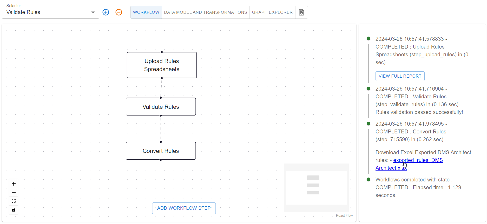

# Analytic Solution Data Model

This tutorial demonstrates how to build a solution model for an analytic use case. We assume that there is already
an enterprise model developed, as in the [Knowledge Acquisition](./part-1-knowledge-acquisition.md) tutorial, which
will be used as the basis for the solution model.

## Introduction

Olav is an analyst at `Acme Corporation`. He is responsible for building forecasting models for the wind farm
to predict the power output of the wind turbines. These forecasts are used by the trading department to sell
the power on the market.

## Download the Enterprise Model

Olav starts by using **NEAT** to download the enterprise model. He opens **NEAT** and selects the `Import DMS`
workflow, and then clicks on the `Import DMS` step. This opens the modal with the configuration for the import

Olav selects the following options:

* **Data model id**: This is the id of the enterprise model. Olav finds this ID by login into CDF.
* **Report formatter**: This is used in the validation of the model. The enterprise model should be valid,
  so this is likely not needed.
* **Role**: This is which format Olav wants to download the model. He selects `information_architect`. This is
  because he wants to focus in the modeling and not the implementation of the model.
* **Reference**: This is whether the imported model should be used as a reference model. Olav sets this to
  true as the enterprise model is a reference model. This means that the enterprise model will not be changed
  and that the solution model will be built on top of the enterprise model.

After clicking `Save` and `Save Workflow`, Olav runs the workflow by clicking `Start Workflow`. The workflow
will execute and Olav can download the exported model by clicking `exported_rules_information_architect.xlsx`.
Note that `rules` is the **NEAT** representation of a data model.

The downloaded spreadsheet contains six sheets:

* **Metadata**: This contains the metadata for the new solution model, and will only have headings
  (see definition of headings [here](../../terminology/rules.md#metadata-sheet))
* **Properties**: This contains the properties for the new solution model, and will only have headings
  (see definition of headings [here](../../terminology/rules.md#properties-sheet))
* **Classes**: This contains the classes for the new solution model, and will only have headings
  (see definition of headings [here](../../terminology/rules.md#classes-sheet))
* **RefProperties**: This will be all the properties from the enterprise model that Olav can use to lookup
  what properties he wants to use in the solution model. In addition, this will be used in the validation
  of the solution model.
* **RefClasses**: This will be all the classes from the enterprise model. Similar to the `RefProperties`,
  this will be used to look up what classes Olav wants to use in the solution model, and will be validated
  against.
* **RefMetadata**: This will be the metadata from the enterprise model. This is there to establish linage
  so that it is clear where the solution model comes from.

## Setting up the Metadata for the Solution Model

Olav starts by setting up the metadata for the solution model. He opens the `Metadata` sheet in the spreadsheet
and fills in the following information:

|             |                                                       |
|-------------|-------------------------------------------------------|
| role        | information architect                                 |
| creator     | Olav                                                  |
| namespace   | http://purl.org/cognite/power_analytic                |
| prefix      | power_analytic                                        |
| schema      | extended                                              |
| created     | 2024-03-26                                            |
| updated     | 2024-02-09                                            |
| version     | 0.1.0                                                 |
| title       | Power Forecast Model                                  |
| description | Solution model for WindFarm power production forecast |

The most important part of the metadata sheet is the `prefix` and `schema`. The `prefix` is used differentiate
the solution model from the enterprise model. If Olav set the `prefix` to the same as the enterprise model, this
would mean that this is an extension of the enterprise model and not a new model. The `schema` is used to
tell **NEAT** that this model is an extension of the enterprise model and that it should be validated against it.

For more information on the metadata sheet, see [here](../../terminology/rules.md#metadata-sheet).

## Selecting from the Enterprise Model

The most important part of Olav's new solution model is the `WindTurbine` and the `WindFarm` concepts. First,
let's look at the `WindTurbine` from the enterprise model.

| Class       | Property             | Value Type |
|-------------|----------------------|------------|
| WindTurbine | name                 | string     |
| WindTurbine | type                 | string     |
| WindTurbine | geoLocation          | Point      |
| WindTurbine | manufacturer         | string     |
| WindTurbine | lifeExpectancy       | integer    |
| WindTurbine | ratedPower           | float      |
| WindTurbine | hubHeight            | float      |
| WindTurbine | actualPower          | timeseries |
| WindTurbine | arrayCableConnection | ArrayCable |

The most important properties for Olav's forecasting model are the `actualPower` and the `ratedPower`. In addition,
he needs the `geoLocation` to calculate the wind speed and the `hubHeight` to adjust the wind speed to the height
of the wind turbine. In addition, there might be differences in the power output between the wind turbines based
on the manufacturer, life expectancy, and the type of wind turbine. However, Olav decides that
`arrayCableConnection` is not important for his forecasting model, so the `WindTurbine`in the solution model will
not have this property.

Next, let's look at the `WindFarm` from the enterprise model.

| Class       | Property             | Value Type         |
|-------------|----------------------|--------------------|
| WindFarm    | name                 | string             |
| WindFarm    | geoLocation          | Polygon            |
| WindFarm    | ratedPower           | float              |
| WindFarm    | activePower          | timeseries         |
| WindFarm    | substation           | OffshoreSubstation |
| WindFarm    | exportCable          | ExportCable        |
| WindFarm    | arrayCable           | ArrayCable         |
| WindFarm    | windTurbines         | WindTurbine        |

Olav decides that this can be simplified for his forecasting model down to `name`, `geoLocation` and `windTurbines`.
The `ratedPower` and `activePower` are not needed as it is the sum for all the `WindTurbines`. The
`substation`, `exportCable`, and `arrayCable` are not needed for the forecasting model.

Based on the choices above, Olav will also include `Point` and `Polygon` from the enterprise model as they are needed
for the `geoLocation` of the `WindTurbine` and `WindFarm`.

## Updating the Spreadsheet.

Olav copies over all the properties from the enterprise model to the solution model. He then removes
the rows that are not needed for the new solution model. The `Properties` spreadsheet will now look as follows
(only the most relevant columns shown here):

| Class       | Property       | Value Type  | ... | Reference                                  |
|-------------|----------------|-------------|-----|--------------------------------------------|
| WindTurbine | name           | string      |     | power:GeneratingUnit(property=name)        |
| WindTurbine | type           | string      |     | power:GeneratingUnit(property=type)        |
| WindTurbine | activePower    | timeseries  |     | power:GeneratingUnit(property=activePower) |
| WindTurbine | geoLocation    | Point       |     | power:GeneratingUnit(property=geoLocation) |
| WindTurbine | manufacturer   | string      |     | power:WindTurbine(property=manufacturer)   |
| WindTurbine | ratedPower     | float       |     | power:WindTurbine(property=ratedPower)     |
| WindTurbine | hubHeight      | float       |     | power:WindTurbine(property=hubHeight)      |
| WindTurbine | lifeExpectancy | integer     |     | power:WindTurbine(property=lifeExpectancy) |
|             |                |             |     |                                            |
| WindFarm    | name           | string      |     | power:EnergyArea(property=name)            |
| WindFarm    | geoLocation    | Polygon     |     | power:EnergyArea(property=geoLocation)     |
| WindFarm    | windTurbines   | WindTurbine |     | power:WindTurbine(property=windTurbines)   |

In addition, Olav removes the parent classes `GeneratingUnit` and `EnergyArea` and instead moves the properties he
needs over to `WindTurbine` and `WindFarm`. He moves the properties by renaming `GeneratingUnit` to `WindTurbine` and
`EnergyArea` to `WindFarm` in the `Class` column. The reason is that the `GeneratingUnit` and `EnergyArea` are generic
concepts that would complicate the solution model as this forecast model is only for wind turbines and cannot be
applied to other types of generating units.

Furthermore, Olav copies over the `GeoLocation`, `Point`, and `Polygon` classes from the enterprise model to the solution
model. In addition, he writes up `WindTurbine` and `WindFarm`. The `Classes` spreadsheet will now look as follows:

| Class       | Parent Class | ... | Reference         |
|-------------|--------------|-----|-------------------|
| GeoLocation | GeoLocation  |     | power:GeoLocation |
| Point       | GeoLocation  |     | power:Point       |
| Polygon     |              |     | power:Polygon     |
| WindTurbine |              |     |                   |
| WindFarm    |              |     |                   |

Notice that both the `Properties` and `Classes` sheets have a `Reference` column. This column is used to tell **NEAT**
that the property or class is coming from the enterprise model. This is used in the validation of the solution model,
as well as when creating the implementation of the solution model.

If we look at the `Class` spreadsheet, we notice that `GeoLocation`, `Point`, and `Polygon` have a reference to the
enterprise model. This is because these three classes are exact copies from the enterprise model, meaning that they
will have the exact same properties as in the enterprise model. This is why Olav did not need to copy over the
properties for these classes.

The `WindTurbine` and `WindFarm` classes do not have a reference to the enterprise model, even though the enterprise
model have a `WindTurbine` and `EnergyArea` class. This is because the `WindTurbine`and `EnergyArea` classes in this
solution model are not the same as the `WindTurbine` and `EnergyArea` classes in the enterprise model. Olav has
already removed the inheritance used in the enterprise model for these classes by moving the properties from
`GeneratingUnit` and `EnergyArea` to `WindTurbine` and `WindFarm`. In addition, as we will see in the next section,
Olav will add new properties to the `WindTurbine` and `WindFarm` classes that are not in the enterprise model.

## Adding new Concepts

To make good forecasts, Olav needs historical and forecasted weather data. Thus, he will have to extend the solution
model with new concepts for the weather data. In addition, he needs to add a concept for the forecasted power output
of the wind turbines.

Olav chose to model the weather data as a `WeatherStation`. The `WeatherStation` concept will look
as follows:

| Class            | Property              | Value Type   |
|------------------|-----------------------|--------------|
| WeatherStation  | name                  | string       |
| WeatherStation  | type                  | string       |
| WeatherStation  | source                | string       |
| WeatherStation  | geoLocation           | Point        |
| WeatherStation  | windSpeed             | timeseries   |
| WeatherStation  | windFromDirection     | timeseries   |
| WeatherStation  | airTemperature        | timeseries   |
| WeatherStation  | airPressureAtSeaLevel | timeseries   |
| WeatherStation  | relativeHumidity      | timeseries   |
| WeatherStation  | cloudAreaFraction     | timeseries   |

The advantage of this concept is that it can be used both for historical weather data and forecasted weather data.

The weather observations will be connected to the `WindFarm`:

| Class        | Property            | Value Type      | Min Count | Max Count | ... | Reference                       |
|--------------|---------------------|-----------------|-----------|-----------|-----|---------------------------------|
| WindFarm     | name                | string          | 1         | 1         |     | power:EnergyArea(property=name) |
| ...          | ...                 | ...             | ...       | ...       |     |                                 |
| WindFarm     | weatherForecasts    | WeatherStation  | 0         | Inf       |     |                                 |
| WindFarm     | weatherObservations | WeatherStation  | 0         | Inf       |     |                                 |

The `weatherForecasts` will be used for the forecasted weather data, and the `weatherObservations` will be used for
the historical weather data.

The forecasted power output of the wind turbines will be modeled as a `timeseriesForecast`:

| Class              | Property        | Value Type | Min Count | Max Count |
|--------------------|-----------------|------------|-----------|-----------|
| timeseriesForecast | name            | string     | 1         | 1         |
| timeseriesForecast | algorithm       | string     | 1         | 1         |
| timeseriesForecast | inputTimeseries | timeseries | 1         | Inf       |
| timeseriesForecast | parameters      | json       | 0         | 1         |
| timeseriesForecast | forecast        | timeseries | 1         | 1         |

The `inputTimeseries` will be the input to the forecasting model, and the `forecast` will be the output of the
forecasting model. The `parameters` will be used to store the parameters used in the forecasting model.

Olav decides to store the forecasted power output for each wind turbine in the `WindFarm`:

| Class        | Property            | Value Type         | Min Count | Max Count | ... | Reference                           |
|--------------|---------------------|--------------------|-----------|-----------|-----|-------------------------------------|
| WindTurbine  | name                | string             | 1         | 1         |     | power:GeneratingUnit(property=name) |
| ...          | ...                 | ...                | ...       | ...       |     |                                     |
| WindTurbine  | powerForecasts      | timeseriesForecast | 0         | Inf       |     |                                     |
| WindTurbine  | minPowerForecast    | timeseries         | 0         | 1         |     |                                     |
| WindTurbine  | mediumPowerForecast | timeseries         | 0         | 1         |     |                                     |
| WindTurbine  | maxPowerForecast    | timeseries         | 0         | 1         |     |                                     |

The `powerForecasts` will be used to store the forecasted power output for each wind turbine. In addition, Olav
adds `minPowerForecast`, `mediumPowerForecast`, and `maxPowerForecast` to store the minimum, medium, and maximum
forecasted power output for the wind farm. The `powerForecasts` property Olav will only be used in the
solution data model, while the `min`, `medium`, and `max` properties will be added back to the enterprise model such
that they can be consumed by other users. See the [Extending the Enterprise Model](./part-3-extending-enterprise-model.md)
tutorial for more information.

In addition, Olav adds `lowPowerForecast`, `highPowerForecast`, and `expectedPowerForecast` to the `WindFarm`:

| Class         | Property              | Value Type | Min Count | Max Count | ... | Reference                       |
|---------------|-----------------------|------------|-----------|-----------|-----|---------------------------------|
| WindFarm      | name                  | string     | 1         | 1         |     | power:EnergyArea(property=name) |
| ...           | ...                   | ...        | ...       | ...       |     |                                 |
| WindFarm      | lowPowerForecast      | timeseries | 0         | 1         |     |                                 |
| WindFarm      | highPowerForecast     | timeseries | 0         | 1         |     |                                 |
| WindFarm      | expectedPowerForecast | timeseries | 0         | 1         |     |                                 |

Similar to the `min`, `medium`, and `max` properties, the `low`, `high`, and `expected` properties will be added
back to the enterprise model.

Notice that for all the new properties that Olav has added, the `Reference` column is empty. This is because these
properties are new and are not in the enterprise model. This is why Olav does not need to reference the enterprise

## Updating the Spreadsheet (Download Olav's Information spreadsheet)

Olav adds the new concepts to the `Properties` and `Classes` sheets in the spreadsheet.

You can download Olav's spreadsheet [here with the information model](../../artifacts/rules/information-analytics-olav.xlsx).

## Implementing the Solution Model
Olav has now defined the solution model for the forecasting use case. The next step is to implement it. First,
Olav uses **NEAT** to convert the spreadsheet he has from information architect to dms architect format. He
does this by selecting the `Validate Rules` workflow. Note that this will also validate that he has
written up the spreadsheet correctly. In the `Validate Rules` workflow, Olav selects the `Convert Rules` step
and sets `Output role format` to `dms_architect`. After running the workflow, Olav can download the converted
spreadsheet by clicking `exported_rules_DMS_Architect.xlsx`.

**NEAT** has given a good out-of-the-box suggestion for how to implement the solution model. However, to ensure that
the solution model is well aligned with the enterprise model and is performant, Olav asks the DMS solution architect,
Alice, to help him.

Alice asks Olav a few questions on how he is planning to use the new `timeseriesForecast` and `WeatherStation`
classes. Based on Olav's answers, Alice suggests that the `name` and `algorithm` in the `**ForecastedPowerOutput**` should
be indexed to ensure that the queries are fast. Also for the `WeatherStation`, Alice suggests that the `name`,
`type`, and `source` should be indexed to ensure that the queries are fast. In addition, Alice ensures that the
new `WindTurbine` and `WindFarm` views are mapping correctly to the `GeneratingUnit`, `EnergyArea`, `WindTurbine`, and
`WindFarm` containers in the enterprise model.

After the implementation is done, Alice validates the solution model by running the `Validate Rules` workflow with
the new spreadsheet as input. The validation is successful, and the solution model is ready to be deployed.

## Updating the Spreadsheet (Download Olav's DMS spreadsheet)

After the conversion and modification with the help of Alice, Olav's DMS spreadsheet is done.

You can download Olav's spreadsheet [here with the MDS model](../../artifacts/rules/dms-analytics-olav.xlsx).

## Deploying the Solution Model

Olav deploys the new solution model by selecting the `Export DMS` workflow. He deactivates the `Export Transformations`
step by removing the dotted line connecting it from the `Export Data Model to CDF` step. This is because he does not
need to create any transformations for populating the new solution model.

## Summary

**Solution Modeller Task**

1. Select from the enterprise model
2. Add new concepts
3. Ensure a good implementation of the solution model

**Analytic Expert usage of **NEAT****:

1. Download the enterprise model.
2. Validate the solution model.
3. Convert the solution model between the different roles.
4. Deploy the model
