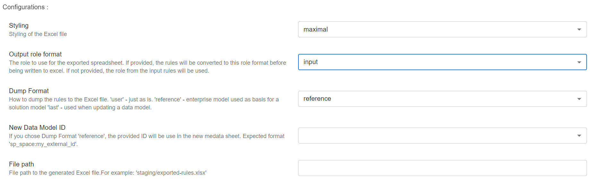

# Extending the Enterprise Model

This tutorial demonstrates how to extend the Enterprise model. Extending a model means changing it
by adding, reshaping, or removing any of its elements **after it has been put in production**.

We assume that there is already an enterprise model developed, as in the
[Knowledge Acquisition](./part-1-knowledge-acquisition.md) tutorial, which will be the one we extend. In addition,
the source for the extension is the solution model developed in the [Solution Modeling](./part-2-analytic-solution.md)
tutorial.

## Introduction

Svein Harald is the head information architect at `Acme Corporation`. He has the ultimate responsibility for the
enterprise model. Olav and his team have now developed a successful timeseries forecast model for power production of the
wind turbines at `Acme Corportation`, and the trading department is now eager to start using these new
forecasts when making decisions on when trading power. Svein Harald has been tasked with helping Olav and his team
share their result with the trading department and the rest of the organization.

## Why Extend the Enterprise Model?

Olav suggests that the simplest way to share the forecast with the trading department is to just give them access to the
forecast solution model and let them use it directly. Svein Harald is not so sure. He is concerned that the forecast
solution model is too detailed and complex for the trading department to use directly. It, for example, contains a
lot of technical information such as the exact parameters of the machine learning model, which is not
relevant for the trading department.

The second suggestion from Olav is to create a new model on top of the forecast solution model that is a subset with
only what is relevant for the trading department. Again, Svein Harald is not so sure. He points out that, even though
this works well for this specific case, it will not scale well. If every department in the organization creates their
own solution models on top of other solution models, it will easily become a lot of duplicated information and
inconsistencies between the models and ultimately enable silos in the organization.

Instead, Svein Harald suggests that they extend the enterprise model with the relevant part of the forecast solution
model. He explains that even though this will be a slightly slower process as more clarification and discussion will likely
be required. It is exactly this clarification and discussion that breaks down the silos in the organization and aligns
the departments to get a shared understanding of the data and the models. Olav understands the point and eagerly
agrees to work with Svein Harald to extend the enterprise model.

## How to Extend the Enterprise Model?

When extending the Enterprise model, it is important to try to avoid doing changes that will require changes in the
solution models and use cases that are built on top of the enterprise model. In `Acme Corporation`, there are already
10 solution models powering 25 use cases that are built on top of the enterprise model. If the enterprise model changes
such that these must be updated, it will be very costly for the organization.

**NEAT** provides three ways to extend any data model depending on the impact of the changes:

* **Additive Changes**: Adding new elements to the model. This is the least intrusive change and will not require
  changes in the solution models or use cases.
* **Reshape Changes**: Changing the structure of the model (e.g., renaming entities). This is a more intrusive
  change and may require changes in the solution models and use cases.
* **Rebuild Changes**: Changing the semantics of the model. This is the most intrusive change and will require changes
  in the solution models and use cases. In addition, it may also require major data migration.

When Svein and Olav are working on the extension, they identify that the changes they are introducing are
Additive Changes as they are adding new forecast elements to the enterprise model.

Thus, in this tutorial, we will only focus on **Additive Changes**. However, what follows are a few examples of
changes that could lead to **Reshape Changes** and **Rebuild Changes**:

* **Renaming of a Concept**. For example, if `Acme Corportation` have been using the term `Power Production` and
  `Power Consumption` in the enterprise model, and they now want to change this to `Energy Production` and
  `Energy Consumption`, this would be a Reshape Change.
* **Changing Type**. For example, in the `WindTurbine`, `ratedPower` is modeled as a `float` and this should de changed
   to a `timeseries`. This would be a Rebuild Change.

**Note** in the last example, if no use cases and solution models are using the `ratedPower` attribute, it would
be a much cheaper change to make than if it was used in many places.

Svein Harald starts by using **NEAT** to download the enterprise model. He opens **NEAT** and selects the `Import DMS`
workflow, and then clicks on the `Import DMS` step. This opens the modal with the configuration for the import

Svein Harald selects the following options:

* **Data model id**: This is the id of the enterprise model. Svein Harald finds this ID by login into CDF.
* **Reference data model id** This can be ignored for now. This is used when you want to update a solution
  model to also download the enterprise model the solution model is built on.
* **Report formatter**: This is used in the validation of the model. The enterprise model should be valid,
  so this is likely not needed.
* **Role**: This is which format Svein Harald wants to download the model. He selects `information_architect`. This is
  because he wants to focus in the modeling and not the implementation of the model.

Furthermore, he clicks on the `Create Excel Sheet` step which opens a modal with the configuration for the export

* **Styling**: `maximal`. This is how the exported Excel document is styled.
* **Output role format**: `intput`. This is the same as the role format in the `Import DMS` step. Svein Harald
  just set it to `input` as this will use the same format as he selected in the `Import DMS` step.
* **Dump Format**: This tells **NEAT** how to write the Excel document. Svein Harald selects `last`
  as he is updating the model, and thus wants the model he downloaded to be in the Last sheets.

After clicking `Save` and `Save Workflow`, Svein Harald runs the workflow by clicking `Start Workflow`. The workflow
will execute and SveinHarald can download the exported model by clicking `exported_rules_information_architect.xlsx`.
Note that `rules` is the **NEAT** representation of a data model.

The downloaded spreadsheet contains six sheets:

* **Metadata**: This contains the metadata for the additions to the Enterprise model, and will only have headings
  (see definition of headings [here](../../terminology/rules.md#metadata-sheet))
* **Properties**: This contains the properties for the changes, and will only have headings
  (see definition of headings [here](../../terminology/rules.md#properties-sheet))
* **Classes**: This contains the classes for the changes, and will only have headings
  (see definition of headings [here](../../terminology/rules.md#classes-sheet))
* **LastProperties**: (READ-ONLY) This will be all the properties from the enterprise model that Svein Harald can use to
  look up what properties he wants to use in the solution model. In addition, this will be used in the validation
  to ensure that the new changes do break the existing model.
* **LastClasses**: (READ-ONLY) This will be all the classes from the current enterprise model. Similar to the `LastProperties`,
  this will be used to look up, and will be validated against.
* **LastMetadata**: (READ-ONLY) This will be the metadata from the current Enterprise model.

**Note** The **Last** sheets are used by **NEAT** for validations, which are dependent the `extension` configuration in the `Metadata`
sheet. In addition, it is used by **NEAT** when deploying to CDF to know which views and containers can be deleted
safely and which should be kept.

## Setting up the Metadata for the Extension

Svein Harald starts by setting up the metadata for the extension. He opens the `Metadata` sheet in the spreadsheet
and fills in the following information:

|               |                               |
|---------------|-------------------------------|
| role          | information architect         |
| creator       | Svein Harald, Olav            |
| dataModelType | enterprise                    |
| namespace     | http://purl.org/cognite/power |
| prefix        | power                         |
| schema        | extended                      |
| extension     | addition                      |
| created       | 2024-03-26                    |
| updated       | 2024-04-07                    |
| version       | 0.1.0                         |
| title         | Power to Consumer Data Model  |
| description   |                               |

The most important part of the metadata sheet is the `prefix`, `schema` and `extension`. The `prefix` is the same as
the `prefix` in the enterprise model and `schema` is set to `extension`. This is used to tell **NEAT** that this
is an extension of the enterprise model. In addition, the `extension` is set to `addition` this tells **NEAT** what
kind of extension this is and thus how it should be validated. This way, Svein Harald and Olav can be sure that they
are not doing a reshaping or rebuilding of the enterprise model by accident.

For more information on the metadata sheet, see [here](../../terminology/rules.md#metadata-sheet).

## Adding new Concepts to the Enterprise Model

Olav tells Svein Harald that it is the timeseries forecast for the `WindTurbine` and `WindFarm` that is relevant for
the trading department. There is no need to include the `TimeseriesForecast` and `WeatherStation` in the enterprise
model from the forecast solution model.

Note here that Svein Harald and Olav are here following a conservative principle of including the bare minimum of
what is needed by the trading department. This is to keep the complexity of the Enterprise model down. In addition, if
they had included the `TimeseriesForecast` and `WeatherStation` in the enterprise model now, but later decided they
actually needed these in the Enterprise model, however, slightly modified, they would have to do a reshaping, or
even rebuilding, of the model, which could be costly. Now, they have more flexibility if they later decide they need
these in the Enterprise model later. A good rule of thumb is to have a concrete use case for including a concept in the
Enterprise model.

Olav has gathered the following six properties from the forecast solution model that he wants to include in the
enterprise model:

| Class       | Property              | Value Type | Min Count | Max Count | ... | Reference |
|-------------|-----------------------|------------|-----------|-----------|-----|-----------|
| WindTurbine | minPowerForecast      | timeseries | 0         | 1         |     |           |
| WindTurbine | mediumPowerForecast   | timeseries | 0         | 1         |     |           |
| WindTurbine | maxPowerForecast      | timeseries | 0         | 1         |     |           |
|             |                       |            |           |           |     |           |
| WindFarm    | lowPowerForecast      | timeseries | 0         | 1         |     |           |
| WindFarm    | highPowerForecast     | timeseries | 0         | 1         |     |           |
| WindFarm    | expectedPowerForecast | timeseries | 0         | 1         |     |           |

Svein Harald thinks this is a good start, but he realizes that there are some opportunities for improvement.

* **Missing Concept**: There seems to be a missing concept in the forecast solution model. We see that it is three
  very similar properties for the `WindTurbine` and `WindFarm`. Svein Harald suggest that they should introduce a
  concept to capture this. He suggests that they introduce a new concept called `TimeseriesForecastProduct`.
* **Inconsistencies***: Even though it is three similar properties for the `WindTurbine` and `WindFarm`, the names
  are different. `min`, `medium`, and `max` for the `WindTurbine` and `low`, `high`, and `expected` for the `WindFarm`.
  By introducing the `TimeseriesForecastProduct`, they can make the names consistent.
* **Extensibility**: Svein Harald also realizes the new concept `TimeseriesForecastProduct` is likely to be extended
  in the future, for example, with a `confidence` property.
* **Modeling**. In the forecast solution model, the forecast is modeled on the `WindTurbine` and `WindFarm`. Svein
  Harald, however, decides that power production forecasts are more generic concepts, so he decides to add it to the
  parent classes `GeneratingUnit` and `EnergyArea` instead. This way, the Enterprise model is ready for forecast of
  other types of generating units and energy areas in the future.

Svein Harald starts by adding the new concepts to the `Properties` sheet in the spreadsheet. He adds the following
rows:

| Class                     | Property      | Value Type                | Min Count | Max Count  |
|---------------------------|---------------|---------------------------|-----------|------------|
| TimeseriesForecastProduct | low           | timeseries                | 1         | 1          |
| TimeseriesForecastProduct | expected      | timeseries                | 1         | 1          |
| TimeseriesForecastProduct | high          | timeseries                | 1         | 1          |
|                           |               |                           |           |            |
| EnergyArea                | powerForecast | TimeseriesForecastProduct | 0         | 1          |
|                           |               |                           |           |            |
| GeneratingUnit            | powerForecast | TimeseriesForecastProduct | 0         | 1          |

With the new class `TimeseriesForecastProduct`, Svein Harald also adds the new class to the `Classes` sheet in the
spreadsheet. He adds the following row:

| Class                     | Parent Class |
|---------------------------|--------------|
| TimeseriesForecastProduct |              |

## Iterating on the Extension

Olav takes the new concept `TimeseriesForecastProduct` to the trading department to get feedback. In the trading
department, the trader Lars points out that it is challenging to get a context for the forecast. He suggests that they
should add `named` and `description` properties to the `TimeseriesForecastProduct`. In addition, he points out that
when he makes a decision based on the forecast, he first needs to be confident in the forecast. Olav asks what
criteria Lars uses to determine whether he is confident in a forecast, and learns that the input data to the forecast
is one of the most important factors. Furthermore, Olav wonders whether he should include a `confidence` property
in the `TimeseriesForecastProduct`. Lars does not have a statical background, and explains that `confidence` becomes
a very abstract concept for him. He instead explains that he is happy with the three different timeseries
`low`, `expected`, and `high` as they give him a good understanding of the forecast and the uncertainty.

Olav goes back to Svein Harald, and together they add the following properties to the `Properties` sheet:

| Class                     | Property    | Value Type | Min Count | Max Count |
|---------------------------|-------------|------------|-----------|-----------|
| TimeseriesForecastProduct | name        | string     | 1         | 1         |
| TimeseriesForecastProduct | description | string     | 0         | 1         |
| TimeseriesForecastProduct | sources     | string     | 0         | Inf       |
| TimeseriesForecastProduct | low         | timeseries | 1         | 1         |
| TimeseriesForecastProduct | expected    | timeseries | 1         | 1         |
| TimeseriesForecastProduct | high        | timeseries | 1         | 1         |

Note that the `sources` property is a list of strings that are used to create the forecast. Olav has checked with
Lars that this is a good way to capture the input data to the forecast.

## Updating the Spreadsheet (Download Svein Harald's Information spreadsheet)

The finished spreadsheet with the extension of the Enterprise model is now done.

You can download it [here](../../artifacts/rules/information-addition-svein-harald.xlsx).

## Implementing the Extension

Svein Harald and Olav have now defined all the extensions of the Enterprise model. Olav is happy with the results, and
leaves it to Svein Harald to get the extension implemented.
First, Svein Harald uses **NEAT** to convert the spreadsheet he has from information architect to dms architect format.
He does this by selecting the `Validate Rules` workflow. Note that this will also validate that he has
written up the spreadsheet correctly. In the `Validate Rules` workflow, Svein Harald selects the `Convert Rules` step
and sets `Output role format` to `dms_architect`. After running the workflow, Svein Harald can download the converted
spreadsheet by clicking `exported_rules_DMS_Architect.xlsx`.

**NEAT** has given a good out-of-the-box suggestion for how to implement the extension model. However, to ensure that
the solution model is well aligned with the existing Enterprise model and is performant, Svein Harald
asks the DMS solution architect, Alice, for help.

Alice and Svein Harald have a discussion about the new concepts. Alice suggests that they should add an index to the
`name` and `sources` properties in the `TimeseriesForecastProduct` to ensure that the queries are performant.
Svein Harald agrees, and they add index to the `name` and `sources` properties in the `Properties` sheet.

In addition, Alice ensures that the new property `powerForecast` in the `EnergyArea` and `GeneratingUnit` views are
in new containers `EnergyArea2` and `GeneratingUnit2` respectively. This is because Svein Harald is doing an addition
to the Enterprise model, and changing the existing containers would be a rebuild of the model.

After the implementation is done, Alice validates the solution model by running the `Validate Rules` workflow with
the new spreadsheet as input. The validation is successful, and the extension model is ready to be deployed.

## Updating the Spreadsheet (Download Olav's DMS spreadsheet)

After the conversion and modification with the help of Alice, Svein Harald has the final spreadsheet that can be
deployed.

You can download it [here DMS model](../../artifacts/rules/dms-addition-svein-harald.xlsx).

## Deploying the Extension

Svein Harald deploys the extended enterprise model by selecting the `Export DMS` workflow. He deactivates the `Export Transformations`
step by removing the dotted line connecting it from the `Export Data Model to CDF` step. This is because he does not
need to create any transformations for populating the new solution model.

Svein Harald then runs the workflow and his solution model is successfully deployed to CDF.

## Summary

**Information Architect usage of NEAT**:

1. Download the enterprise model.
2. Validate extension against existing enterprise model.
3. Deploy the extension.
