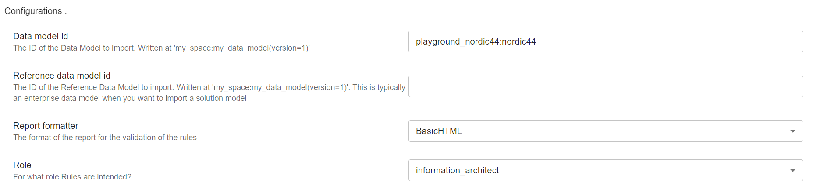

## Extending Solution Model

This tutorial demonstrates how to extend a solution model. Note that extending a model means changing it
by adding, reshaping, or removing any of its elements **after it has been put in production**.

We assume that you already have a solution model built on top of an Enterprise Data Model. This
tutorial will be an extension of the [Analytic Solution Model](./part-2-analytic-solution),
with the Enterprise Data Model from [Extending an Enterprise Data Model](./part-3-extending-enterprise-model).

## Introduction

After getting the core concepts from his analytic solution model into the Enterprise Data Model, Olav
wants to update his solution model to utilize the concepts from the Enterprise Data Model. This will enable
him to write his timeseries forecast which can then be utilized by the trading department.

## Downloading the Current Solution Model

Olav starts by using **NEAT** to download the enterprise model. He opens **NEAT** and selects the `Import DMS`
workflow, and then clicks on the `Import DMS` step. This opens the modal with the configuration for the import

Olav selects the following options:

* **Data model id**: This is the ID of the current analytic solution model.
* **Reference data model id** This is the ID of the enterprise model that the solution model is based.
* **Report formatter**: This is used in the validation of the model. The current solution model should be valid,
  so this is likely not needed.
* **Role**: This is which format Olav wants to download the model. He selects `dms_architect` as he wants the
  model in the implementation format as he will focus on how data is stored in the model.

Furthermore, he clicks on the `Create Excel Sheet` step which opens a modal with the configuration for the export

* **Styling**: `maximal`. This is how the exported Excel document is styled.
* **Output role format**: `intput`. This is the same as the role format in the `Import DMS` step. Svein Harald
  just set it to `input` as this will use the same format as he selected in the `Import DMS` step.
* **Dump Format**: This tells **NEAT** how to write the Excel document. Olav selects `last`
  as he is updating the model, and thus wants the model he downloaded to be in the Last sheets.

After clicking `Save` and `Save Workflow`, Olav runs the workflow by clicking `Start Workflow`. The workflow
will execute and Olav can download the exported model by clicking `exported_rules_dms_architect.xlsx`.
Note that `rules` is the **NEAT** representation of a data model.

The downloaded spreadsheet contains three sets of sheets, user, last and reference. The user sheet does
not have any prefix and are the following:

* **Metadata**: This contains the metadata for extended solution model, this is prefilled based on the
  the configuration Olav selected in the `Import DMS` step.
  (see definition of headings [here](../../terminology/rules.md#metadata-sheet))
* **Properties**: This contains the properties for the changes, and will only have headings
  (see definition of headings [here](../../terminology/rules.md#properties-sheet))
* **Views**: This contains the views for the changes, and will only have headings
  (see definition of headings [here](../../terminology/rules.md#views-sheet))
* **Containers**: This contains the containers for the changes, and will only have headings
  (see definition of headings [here](../../terminology/rules.md#containers-sheet))

In addition, there are four sheets with the prefix `Last`, these are READ-ONLY and represent the previous
version of the solution model. Finally, there are four sheets with the prefix `Reference`, these are READ-ONLY
and represent the enterprise model that the solution model is based on.

**Note** The **Last** and **Ref** sheets are used by **NEAT** for validation, and are dependent on the `extension`
configuration in the `Metadata` sheet.

## Rebuilding the Solution Model

Olav starts by setting up the metadata for the extension. He opens the `Metadata` sheet in the spreadsheet,
it looks like this:

|               |                      |
| ------------- | -------------------- |
| role          | DMS Architect        |
| dataModelType | solution             |
| schema        | extended             |
| extension     | rebuild              |
| space         | power_analytics      |
| name          | Power Forecast Model |
| description   |                      |
| externalId    | power_forecast_model |
| creator       | Olav                 |
| created       | 2024-03-26           |
| updated       | 2024-04-07           |
| version       | 0.1.0                |

Olav has done one change to the metadata, he has set the `extension` to `rebuild` (from `addition`). This is because
Olav wants to completely remake the solution model to utilize the enterprise model, and he is ok with
losing data in the current solution model as that was just a prototype.

Next, Olav copies over all views from the `Last` sheets to the `Views` sheet in the spreadsheet. In addition, Olav
wants to use the new `TimeseriesForecastProduct` from the enterprise model in his solution model. He goes to the
`RefViews` sheet and copies over the `TimeseriesForecastProduct` row to the `Views` sheet in the spreadsheet.
This gives him the following views in the spreadsheet:

| Class                     | Implements    | ... | Reference                                      |
| ------------------------- | ------------- | --- | ---------------------------------------------- |
| Point                     | power:Point   |     |                                                |
| Polygon                   | power:Polygon |     |                                                |
| PowerForecast             |               |     |                                                |
| WeatherStation            |               |     |                                                |
| WindFarm                  |               |     |                                                |
| WindTurbine               |               |     |                                                |
| TimeseriesForecastProduct |               |     | power:TimeseriesForecastProduct(version=0.1.0) |

Looking at the different views, Olav wants to have `Point`, `Polygon` and `TimeseriesForecastProduct`
from the Enterprise model unchanged. Furthermore, he also wants to keep the `PowerForecast` and `WeatherStation`
unchanged from the last version of the solution model. However, he wants to update the `WindFarm` and `WindTurbine`
with the new properties from the enterprise model.

To implement this, Olav can leave the `Point`, `Polygon`, and `TimeseriesForecastProduct` views as they are,
as these have a reference (or implements) their respective enterprise views. Furthermore, as Olav has set
the `extension` to `rebuild`, **NEAT** will use the `Last` sheets to create the `PowerForecast` and `WeatherStation`
views as long as these have **no** properties in the `Properties` sheet. For the views Olav wants to change, `WindFarm` and
`WindTurbine`, he needs to list **all** the properties he wants for these views the `Properties` sheet. This is how
**NEAT** knows what properties to keep, modify or remove.

Olav copies over the `WindFarm` and `WindTurbine` properties from the `LastProperties` to the `Properties` sheet. He
then replaces the `low`, `expected` and `highPowerForecast` properties with the `powerForecast` property from the
`RefProperties` sheet for the `WindFarm`. Similarly, he replaces the `min`, `medium`, and `maxPowerForecast` with the
`powerForecast` property from the `RefProperties` sheet for the `WindTurbine`. This gives him the following
properties in the spreadsheet:

| View        | View Property       | Connection | Value Type                | Reference                                                   | Container             | Container Property |
| ----------- | ------------------- | ---------- | ------------------------- |-------------------------------------------------------------|-----------------------| ------------------ |
| WindFarm    | geoLocation         | direct     | Polygon                   |                                                             | power:EnergyArea      | geoLocation        |
| WindFarm    | name                |            | text                      |                                                             | power:EnergyArea      | name               |
| WindFarm    | weatherForecasts    | edge       | WeatherStation            |                                                             |                       |                    |
| WindFarm    | weatherObservations | edge       | WeatherStation            |                                                             |                       |                    |
| WindFarm    | powerForecast       | direct     | TimeseriesForecastProduct | power:EnergyArea(version=0.1.0,property=powerForecast)      | power:EnergyArea2     | powerForecast      |
| WindFarm    | windTurbines        | edge       | WindTurbine               |                                                             |                       |                    |
|             |                     |            |                           |                                                             |                       |                    |
| WindTurbine | activePower         |            | timeseries                |                                                             | power:GeneratingUnit  | activePower        |
| WindTurbine | geoLocation         | direct     | Point                     |                                                             | power:GeneratingUnit  | geoLocation        |
| WindTurbine | hubHeight           |            | float64                   |                                                             | power:WindTurbine     | hubHeight          |
| WindTurbine | lifeExpectancy      |            | int32                     |                                                             | power:WindTurbine     | lifeExpectancy     |
| WindTurbine | manufacturer        |            | text                      |                                                             | power:WindTurbine     | manufacturer       |
| WindTurbine | powerForecast       | direct     | TimeseriesForecastProduct | power:GeneratingUnit(version=0.1.0,property=powerForecast)  | power:GeneratingUnit2 | powerForecast      |
| WindTurbine | name                |            | text                      |                                                             | power:GeneratingUnit  | name               |
| WindTurbine | powerForecasts      | edge       | PowerForecast             |                                                             |                       |                    |
| WindTurbine | ratedPower          |            | float64                   |                                                             | power:WindTurbine     | ratedPower         |
| WindTurbine | type                |            | text                      |                                                             | power:GeneratingUnit  | type               |

Looking through the properties, Olav notices that the new `powerForecast` property makes the need for an extra container
for the `WindFarm` and `WindTurbine` is not needed. Thus, he leaves the `Containers` sheet empty.

## Updating the Spreadsheet (Download Olav's DMS Updated spreadsheet)

The finished spreadsheet with the extension of the analytic solution model can be found
[here](../../artifacts/rules/dms_rebuild_olav.xlsx).

## Deploying the Rebuilt Solution Model

## Summary

**Usage of NEAT**:

1. Download the solution model with the enterprise model.
2. Validate extension against existing solution model.
3. Deploy the extension.
