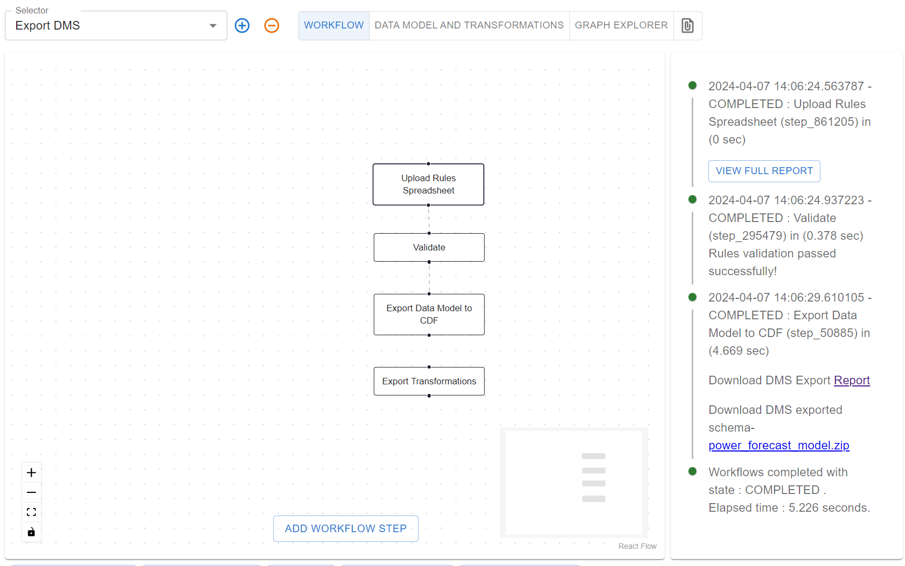

## Business Solution Model

In this tutorial, we will demonstrate how to create a solution model for a business case
using the enterprise model as the basis. The business solution model will only use a subset
of the enterprise model and not add any new concepts. This model is intended for a business user
that only needs to select the part of the enterprise model that is relevant for their business case.

We will build on the Enterprise model from [Extending an Enterprise Data Model](./part-3-extending-enterprise-model).

### Introduction

We met Camilla in [Extending an Enterprise Data Model](./part-3-extending-enterprise-model), she was interested in
the forecast produced by Olav. This triggered Olav to work with Svein Harald, the head Information Architect, to extend
the Enterprise Model, with input from Camilla. Now that the Wind Farm forecasts are available, Camilla wants to create
her own business solution model. This will be the basis for dashboard for the trading department with the most
up-to-date forecast for the power production of `Acme Corporation`'s wind farms.

### Download the Enterprise Model

Camilla starts by using **NEAT** to download the enterprise model. She opens **NEAT** and selects the `Import DMS`
workflow, and then clicks on the `Import DMS` step. This opens the modal with the configuration for the import

Camilla selects the following options:

* **Data model id**: This is the ID of the enterprise model, `power:power_to_consumer(version=0.1.0)`.
* **Report formatter**: This is used in the validation of the model. The current solution model should be valid,
  so this is likely not needed.
* **Role**: This is which format Camilla wants to output the downloaded model. Camilla is not an expert implementation
  she just wants to select the concepts she wants, thus she select `information_architect`

Furthermore, he clicks on the `Create Excel Sheet` step which opens a modal with the configuration for the export

* **Styling**: `maximal`. This is how the exported Excel document is styled.
* **Output role format**: `intput`. This is the same as the role format in the `Import DMS` step. Olav
  just set it to `input` as this will use the same format as he selected in the `Import DMS` step._
* **Dump Format**: This tells **NEAT** how to write the Excel document. Camilla selects `reference`
  as she will use this as the basis for the business solution model.
* **New Data Model ID**: This is the ID of the new data model, by setting this **NEAT** will automatically create
  the metadata sheet for the new model. Camilla sets it to `sp_trading:power_forecast`.

After clicking `Save` and `Save Workflow`, Camilla runs the workflow by clicking `Start Workflow`. The workflow
will execute and Camilla can download the exported model by clicking `exported_rules_information_architect.xlsx`.
Note that `rules` is the **NEAT** representation of a data model.

The downloaded spreadsheet contains two sets of sheets, user and reference. The user sheet does
not have any prefix and are the following:

* **Metadata**: This contains the metadata for solution model, this is prefilled based on
  the configuration Camilla selected in the `Import DMS` step.
  (see definition of headings [here](../../terminology/rules.md#metadata-sheet))
* **Properties**: This is empty and will be were the properties for the new model are added.
  (see definition of headings [here](../../terminology/rules.md#properties-sheet))
* **Classes** This is empty and will be were the classes for the new model are added.
  (see definition of headings [here](../../terminology/rules.md#classes-sheet))

In addition, there are three sheets with the prefix `Ref`, these are READ-ONLY
and represent the enterprise model that will be the basis for the new solution model.

### Creating the Business Solution Model

Camilla starts by setting up the metadata for the new solution model. Since she filled in
the `New Data Model ID` in the `Export DMS` step, the metadata sheet is already prefilled, and all
she needs to do is to replace `<YOUR NAME>` with `Camilla` in the `creator` field.

|               |                       |
| ------------- | --------------------- |
| role          | information architect |
| dataModelType | solution              |
| schema        | complete              |
| prefix        | sp_trading            |
| name          | power_forecast        |
| description   |                       |
| externalId    | power_forecast        |
| creator       | Camilla               |
| version       | 1                     |

Looking through the `RefClasses` and `RefProperties` sheets, Camilla initially feels slightly overwhelmed as
there are a lot of concepts and details in the Enterprise model. However, she recalls her conversion with Olav
and starts to recognize some of the concepts that are relevant for her. It turns out that
it is only `TimeseriesForecastProduct` and `WindFarm` that are necessary. She starts by looking at the `TimeseriesForecastProduct`
properties, and she needs all of them, so she copies over the row with `TimeseriesForecastProduct` from the `RefClasses` sheet
to the `Classes` sheet. `WindFarm` seems to be missing some properties as it only has `arrayCable`
`exportCable`, `substation`, and `windTurbines`. But then she notices that `WindFarm` has a parent called `EnergyArea`
which has the properties `name` and `powerForecast`. So she copies over these two rows from the `RefProperties` sheet
to the `Properties` sheet. She does not want to have `EnergyArea` in her model, so she renames `EnergyArea` to `WindFarm`
in the `Class` column in the `Properties` sheet. Finally, since she now has `WindFarm` in her `Properties` sheet,
she needs to have it in the `Classes` sheet as well. However, this will not be the same as the `WindFarm` in the `RefClasses`
so she adds a new row with `WindFarm` in the `Classes` sheet.

The final class sheet for Camilla's solution model looks like this:

| Class                     | ... | Reference                       |
| ------------------------- | --- | ------------------------------- |
| TimeSeriesForecastProduct |     | power:TimeseriesForecastProduct |
| WindFarm                  |     |                                 |

In addition, the `Properties` sheet looks like this:

| Class    | Property      | Name | Description | Value Type                | Min Count | Max Count | Default | Reference                                |
| -------- | ------------- | ---- | ----------- | ------------------------- | --------- | --------- | ------- | ---------------------------------------- |
| WindFarm | name          |      |             | string                    | 1         | 1         |         | power:EnergyArea(property=name)          |
| WindFarm | powerForecast |      |             | TimeseriesForecastProduct | 0         | 1         |         | power:EnergyArea(property=powerForecast) |

### The Finished Spreadsheet (Download Camilla's Spreadsheet)

The finished spreadsheet for Camilla's business solution model can be downloaded [here](../../artifacts/rules/information-business-camilla.xlsx).

### Deploy the Business Solution Model

Camilla deploys her data model by selecting the `Export DMS` workflow. She deactivates the `Export Transformations`
step by removing the dotted line connecting it from the `Export Data Model to CDF` step. This is because she does not
need to create any transformations for populating the new solution model.

Camilla then runs the workflow and her solution model is successfully deployed to CDF.

### Summary

**Usage of NEAT**

1. Download the Enterprise Model as a reference.
2. Validate the created Business Solution Model.
3. Deploy the Business Solution Model.
