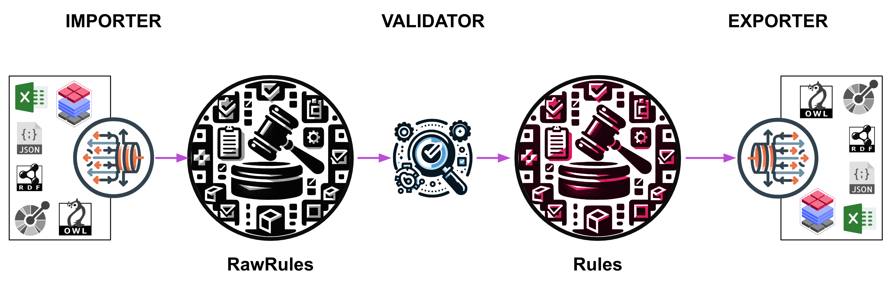

# Data Modeling Flow

The data modeling flow, depicted in the figure below, consists of three main steps, and corresponding three subpackages in NEAT:

- [Importer](../reference/rules/importers.md)
- [Validator](../reference/rules/models.md)
- [Exporter](../reference/rules/exporters.md)

The importer step is responsible for importing data models from various sources and converting them into `RawRules`, an internal unvalidated NEAT data model represenation, that can be used in the rest of the flow. The imported `RawRules` are run through validator that checks for errors and inconsistencies, ensuring that it meets the required standards and specifications of `Rules` object, an internal validated NEAT data model represenation.

Finally, the exporter step takes the validated `Rules` and exports it to a format that can be used by other systems or applications, such as Cognite Data Fusion.

All three subpackages are modular with well defined interfaces allowing further extensibility of NEAT.

## Importers

### Excel Importer

The Excel importer imports `RawRules`/`Rules` object from its Excel/Spreadsheet representation.
The Excel `Rules` is the main `Rules` representation. It provides the easiest and the most inclusive and collaborative way to create and edit data models.
More about `Rules`, and especially their Excel representation, can be found in [this dedicated section of the documentation](./rules.md).

### Google Sheet Importer

The Google Sheet importer is same as the Excel importer with the main difference being that it allows fetching Google Sheet from a Google Drive.

### YAML Importer

The YAML importer import `Rules` serialization (`pydantic.model_dump`) into `Rules` object.

### JSON Importer

The JSON importer, same as the YAML importer, import `Rules` serialization (`model_dump`) into `Rules` object.

### DMS Importer

The Data Model Storage (DMS) importer imports DMS data model, composed of views, into `RawRules`/`Rules` representation. [Consult reference library documentation for the importer implementation](../reference/rules/importers.md#cognite.neat.rules.importer.DMSImporter).

### Graph Importer

The Graph importer performs analysis and inference of data model which resultes in the inferred `RawRules`/`Rules` object, from the RDF graph (graph tech used by NEAT). [CConsult reference library documentation for the importer implementation](../reference/rules/importers.md#cognite.neat.rules.importer.GraphImporter).

### OWL Ontology Importer

The OWL importer imports OWL (Web Ontology Language) ontology to `RawRules` representation. It is critical to know that ontologies, due to the various degree of completition and as they are often used for information modeling and not data modeling, often cannot be resolved into validated `Rules`. It is strongly suggested to export the derived `RawRules` to the Excel representation for futher editing towards the data model completition. [Consult reference library documentation for the importer implementation](../reference/rules/importers.md#cognite.neat.rules.importer.OWLImporter).

### XML Importer

The XML importer import `RawRules`/`Rules` from an XML Schema. [Consult reference library documentation for the importer implementation](../reference/rules/importers.md#cognite.neat.rules.importer.XMLImporter).

!!! note annotate "WIP"

    This importer is work in progress!

### OpenAPI Importer

The OpenAPI importer, imports a schema from OpenAPI specification to `RawRules`/`Rules` object. Currently this importer is only available as the [OpenApiToRules](./steps-library.html#openapitorules) step in the [library of steps](./steps-library.md), therefore only users of docker container distribution of NEAT have access to it.

!!! note annotate "Alpha feature"

    This importer is tagged as alpha, meaning it is not a stable component to become a part of the standard NEAT library. Read more about our policy of [Lifecycle of NEAT Components](./componenets-lifecycle-policy.md)

## Raw Rules

`Rules` are typically in the first place imported in their raw representation `RawRules`, which is basically object which is not validated against a number of validators.

## Validator

NEAT contains large number of validators, which assure that validates `RawRules` can be used for downstream applications, such as for example configuration of data model in Cognite Data Fusion. When resolving `RawRules` to `Rules` user can configure NEAT to generate validation report that will indicate all the errors and warnings the validation step brought up. By resolving errors neat users are able to create a valid `Rules` object. To help them in this NEAT contains a dedicated [Exceptions module](../reference/exceptions.md) with humane definition of NEAT exceptions with aim of educating users. Each exception contains resolvable identifier (basically URL) to the additional description on when an exception occurs and how to fix it.

## Rules

Once `RawRules` goes through the validator module/step they are turned into `Rules`, an internal validated NEAT data model represenation.

## Exporters

Similar to [Importers](./data-modeling-flow.md#importers), NEAT comprises of a suite of `Rules` exporters to formats that can be used by downstreams applications, such as Cognite Data Fusion or [Protégé](https://protege.stanford.edu/).

### Excel Exporter

The Excel exporter exports `RawRules` or `Rules` object to their Excel representation. [Consult reference library documentation for the exporter implementation](../reference/rules/exporters.md#cognite.neat.rules.exporter.rules2excel.ExcelExporter).

### DMS Exporter

The DMS Exporter exports `Rules` as a DMS data model comprised of a set of DMS containers and DMS views. The DMS exporter will be continiously developed and extended, as it represents the most critical NEAT exporter. [Consult reference library documentation for the exporter implementation](../reference/rules/exporters.md#cognite.neat.rules.exporter.rules2dms.DataModel).

!!! note annotate "Current Limitations"

    Currently `Rules` are exported as a set of views and containers with the same name and in the same space.
    There is currently ongoing a "Phase2" project which ends in March '24 which would enable advance data modeling concepts,
    such as mapping between views and containers accross various spaces. Contact NEAT developers for more details.

### Ontology Exporter

The Ontology exporter exports `Rules` object to [OWL](https://www.w3.org/OWL/) ontology, which can be used in for example [Protégé](https://protege.stanford.edu/), or deployed and published on web via [an RDF store](https://en.wikipedia.org/wiki/Triplestore). [Consult reference library documentation for the exporter implementation](../reference/rules/exporters.md#cognite.neat.rules.exporter.rules2ontology.Ontology.as_owl).

### SHACL Exporter

Similar to the Ontology exporter, [SHACL](https://www.w3.org/TR/shacl/) (Shapes Constraint Language) exporter exports `Rules` to underlaying SHACL shapes provided as triples, which can be used to validated RDF graphs. [Consult reference library documentation for the exporter implementation](../reference/rules/exporters.md#cognite.neat.rules.exporter.rules2ontology.Ontology.as_shacl).

### GraphQL Exporter

The Graph exporter exports `Rules` to `GraphQL` schema, consisting of `types` and `fields`. [Consult reference library documentation for the exporter implementation](../reference/rules/exporters.md#cognite.neat.rules.exporter.rules2graphql.GraphQLSchema).

# Graph ETL Flow
The Graph ETL (Extract, Transform, Load) flow in NEAT is a systematic flow that involves extracting graph from a source system/format, optionally transforming this graph by reducing complexity, enriching it with additional information, and then loading the transformed or original graph into Cognite Data Fusion. This process facilitates the efficient manipulation and loading of graph data, enabling users to form knowledge base in Cognite Data Fusion. The ETL flow is divided into three main stages: the Extractor, the Transformer, and the Loader.

To use Graph ETL Flow one needs to have compliant `Rules` extended with configuration of graph ETL through combination of `rdfpath`, `sparql` and/or `rawlookup` directives (aka transformation rules).

## Extractor
It is worth to mention that all the extractors have one aim and that is to extract RDF triples from source to [NeatGraphStore](../reference/graph/stores.md#neatgraph-store). In some cases a certain conversion of source data to triples is performed.

### RDF Extractor
The RDF Extractor is a component of the Graph ETL flow in NEAT. It is responsible for extracting RDF triples from RDF (Resource Description Framework) sources. RDF is a standard model for data interchange on the Web. The RDF Extractor reads RDF data, which can be in various formats such as XML, Turtle, or JSON-LD, and load them to `NeatGraphStore`, which is then used in the rest of the Graph ETL flow. The most simplest use-case is to extract triples from a RDF file dump.

### Graph Capturing Sheet Extractor
This extractor extracts triples from a tailored spreadsheet template generated based on data model described in `Rules`. More details about this extractor can be found in [the reference documentation](../reference/graph/extractors.md#cognite.neat.graph.extractors.graph_sheet_to_graph.extract_graph_from_sheet).

### DMS Extractor
This extractor extracts triples from nodes and edges stored in Cognite's Data Model Storage. Basically this extractor has also a role of converting nodes and edges to a set of triples which can be loaded to `NeatGraphStore` for downstream processing and transformations.

!!! note annotate "WIP"

    This extractor is work in progress, and it not in general availability!

## Source Graph
Source graph is stored in [NeatGraphStore](../reference/graph/stores.md#neatgraph-store) that can be configured as:

- internal `in-memory` or `on-disk` RDF triple store
- remote RDF triple store (requires connection to the remote [SPARQL endpoint](https://medium.com/virtuoso-blog/what-is-a-sparql-endpoint-and-why-is-it-important-b3c9e6a20a8b))

## Transformer
NEAT contains its own transformation engine which, as mentioned earlier, is configured through `Rules` via [transformation rules](./transformation-directive-types.md). Predominately, the transformation engine leverages on graph traversal via `SPARQL` queries against the source graph. These queries are either explicitly stated through `sparql` directives, or implicitly constructed using `rdfpath` ([see more details](./transformation-directive-types.md#rdfpath-rule-singleproperty)). The library module for this step in the graph ETL flow consists of a single method which is described in more details in [the reference library](../reference/graph/transformers.md).

## Transformed Graph
The derived transformed graph also makes use of `NeatGraphStore`.

## Loader
Opposite to Extractors, loaders resolve RDF triples stored in `NeatGraphStore` to downstream Cognite Data Fusion representations.

### Asset Hierarchy Loader
Asset hierarchy loader turns RDF triples to CDF asset hierarchy and relations among the assets. This downstream representation is also known as classic CDF, as it was the first data model representation in Cognite Data Fusion.

### DMS Loader
DMS loader turns RDF triples in set of nodes and edges which are stored in DMS.

### RDF Loader
Optionally RDF triples stored in the `NeatGraphStore` can be exported as an RDF drop for later use.

!!! note annotate "WIP"

    This extractor is work in progress, and it not in general availability!
