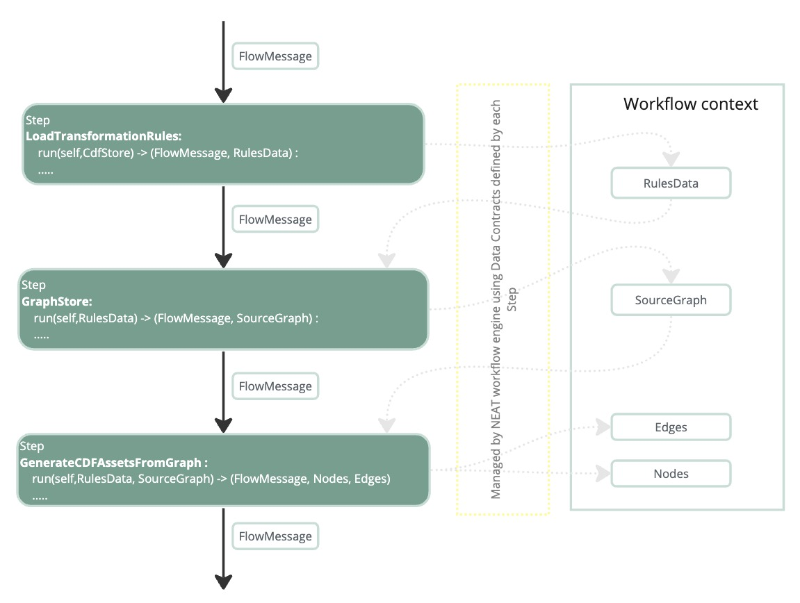
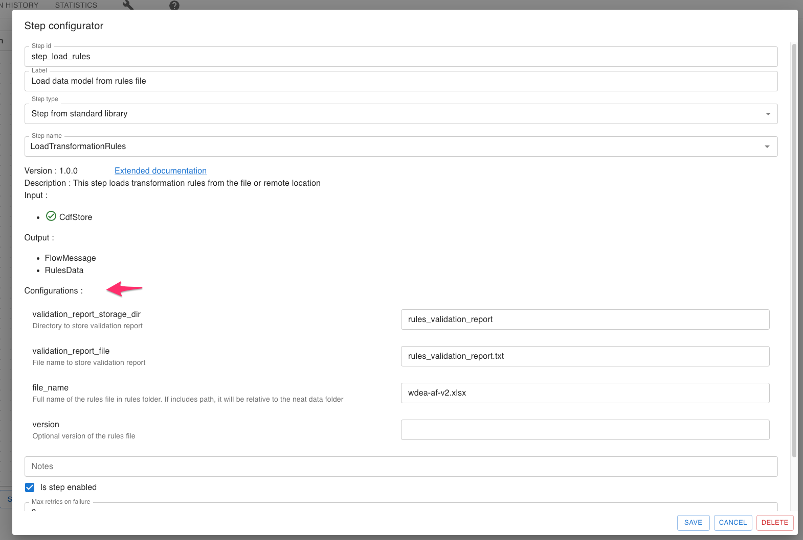
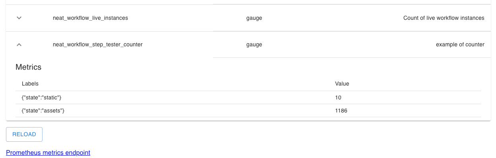

# Workflow Steps


Step is a block of isolated functionality that is packaged into python class that is inherited from `Step` base class. Steps are organized into workflows and executed in a specific order. Each step can have input , output parameters and each step is configurable. Input parameters are passed to step from Flow context according to their data contract . Output parameters are stored in Flow context and can be used by other steps.

NEAT project provides a collection of steps that can be used to build workflows.In addition to that, you can create your own steps and use them in your workflows.

### Creating your own step

To create your own step you need to create a python class that inherits from `Step` base class and implement `run` method. `run` method is the entry point of your step.
Custom step may reside in two places:

- in the same folder as your workflow , for example `neat_data_folder/workflows/my_workflow/my_step.py`
- in the `steps` folder of your project data folder , for example `neat_data_folder/steps/my_step.py`

Steps can import other modules from the same folder or from the `steps` folder. Both folders are added to the python path during the workflow execution.

### Step Data Contracts and Workflow Context

Each step has input and output data contracts. Input data contract is a list of input parameters that step expects to receive from the workflow context. Output data contract is a list of output parameters that step will store in the workflow context.




### Step Configurables

Each step can have a list of configurable parameters. Configurable parameters are used to configure step behavior. Configurable parameters are stored in the workflow context and can be changed during the workflow execution. Configurable parameters are defined as a list of `Configurable` objects. Each `Configurable` object has the following properties:

- `name` - name of the configurable parameter
- `value` - default value of the configurable parameter
- `label` - humand readable label or short description of the configurable parameter
- `type` - type of the configurable parameter. Supported types are `string` , `secret` , `number` , `boolean` , `json`
- `options` - list of options for configurable parameter. This property is used only for `list` type.



### Step Metrics

Each step can have a list of metrics. Metrics are used to monitor step execution. Metrics are stored as Prometheus metrics and can be viewed in NEAT metrics UI and scraped by Prometheus

```python

prom_counter = cast(Gauge,self.metrics.register_metric(
                "counter",
                "example of counter",
                m_type="gauge",
                metric_labels=["state"],
            ),
)
prom_counter.labels(state="static").set(counter_value)

```




### Complete example of custom step

```python

from typing import cast
from prometheus_client import Gauge
from cognite.neat.workflows.model import FlowMessage
from cognite.neat.workflows.steps.step_model import Configurable, Step
from cognite.client import CogniteClient

__all__ = ["RunIdReporter"]


class RunIdReporter(Step):
    description = "Return count of assets and workflow run id"
    category = "example"
    version = "0.1.0-beta"
    configurables = [Configurable(name="static_value", value="10", label="Static value")]

    def run(self, cdf_client: CogniteClient) -> FlowMessage:
        counter_value = int(self.configs["static_value"])
        prom_counter = cast(
            Gauge,
            self.metrics.register_metric(
                "counter",
                "example of counter",
                m_type="gauge",
                metric_labels=["state"],
            ),
        )

        prom_counter.labels(state="static").set(counter_value)
        assets_count = cdf_client.assets.aggregate()[0]["count"]
        prom_counter.labels(state="assets").set(assets_count)
        return FlowMessage(
            output_text=f"Workflow name = {self.workflow_id} , \
              workflow_run_id = {self.workflow_run_id} , assets_count = {assets_count}"
        )

```
