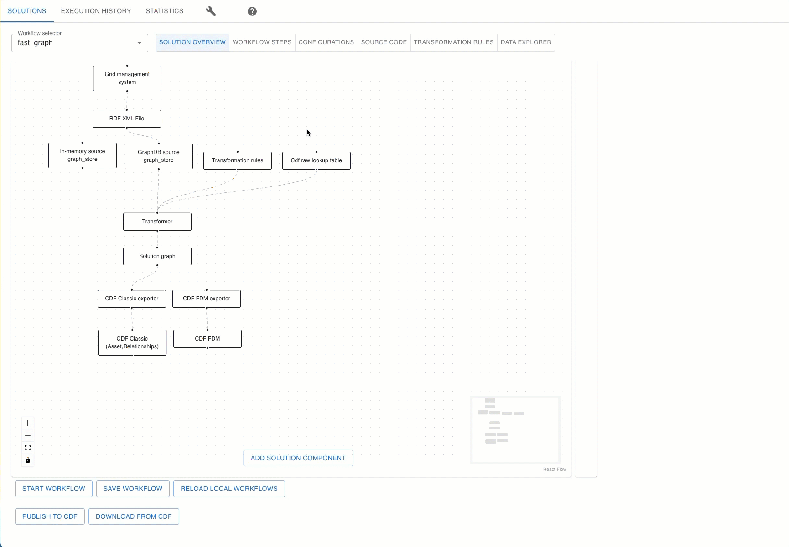

# Neat Workflows

Neat Workflow is concept that enables users to automate complex processes involving multiple steps and systems.
The workflow engine follows a modular, step-by-step process that can be customized to suit your specific data transformation needs. Each step in the workflow corresponds to a specific task, such as loading transformation rules, configuring graph stores, and loading the source graph.
Users can customize the workflow by adding or removing steps, or by modifying the parameters in each step to match their specific data requirements.



## Terminology

- **Solution** - a package that contains a set of workflows, rules and other components that are used to solve a specific problem.
- **Workflow** - a set of steps that are executed in a specific order.
- **Step** - a single block of code (function) that is executed as part of a workflow.
- **Trigger** -  a special type of step that can be used to trigger workflow execution.
- **Task** - is a special type of step that has provided implementation (no need to implement it in *workflow.py*) and can be used to perform some common tasks.
- **Flow message** - a message that is passed between steps. The message is a dictionary that contains information about the current state of the workflow.
- **Workflow implementation class** - individual steps that make up the workflow and defined as python functions. All steps are aggregated into a single workflow class.
- **Workflow manifest** - a YAML file that contains information about the workflow configuration , steps transitions , triggers and tasks cofiuration and other workflow related metadat.
- **Workflow context** - all local variables that are defined in the workflow class and can be accessed by all steps.Information between steps is passed via the workflow context or flow message.
- **Workflow Engine** - internal service that orchestrates steps execution.
- **Configurations** - a set of configurable parameters that are separated from the workflow logic and stored in manifest file (*workflow.yaml*). Configurations can be updated by a user via UI or API.
- **Transformation Rules** - Definition of data model and a set of rules that define how the data should be transformed from the source graph to the solution graph to the CDF resources. The rules are defined as Excel file.
- **Data modelling functions** - a collection of functions for data modelling. The functions are defined in a python module and provided by NEAT project.
- **Data transformation functions** - a collection of functions that define how the data should be transformed from the solution graph to the CDF resources. The functions are defined in a python module and provided by NEAT project.
- **Workflow Execution History** - a set of records that contain information about workflow execution history. The records are stored in the CDF and can be accessed via UI or API.

### Rules and conventions:

- Each workflow must reside in its own folder and folder name defines workflow name.
- Workflow class name must end with `NeatWorkflow` , for example `BasicNeatWorkflow` and must implement `BaseWorkflow` class from `from cognite.neat.core.workflow.base`
- Workflow folder must contain at least 2 files :
    - `workflow.py` - steps/workflow implementation file
    - `workflow.yaml` - manifest and configurations
- Each method that should be orchestrated by workflow engine must be prefixed with `step_` , each method must have single argument of `FlowMessage` type and return `FlowMessage` or `None`.
- FlowMessage is passed from one step to another and it's captured in execution log.
- FlowMessage can have `next_step_ids` property that defines which steps should be executed next. If `next_step_ids` is not set, next step will be executed based on execution graph defined in manifest.
- FlowMessage can have `output_text` property that defines what should be logged in execution log and available in UI. If `output_text` is not set, method name will be used as output text.
- FlowMessage can have `error_text` property that defines error message that should be logged in execution log and available in UI in case of error.

Manifest file consist of 3 main sections:

- `configs` - workflow configuration parameters.
- `steps` - steps metadata.
- `system_components` - system or solutions components, is used for documentation purpose only.
- `description` - short description of the workflow.
- `implementation_module` - alternative workflow implementation module name.If not set, `workflow.py` will be used. Can we used to reuse workflow implementation from another workflow.


### Steps

 Step is a single block of code (method of workflow class) that is executed as part of a workflow. Multiple step methods are aggregated into workflow class (*workflow.py* file).


### Triggers

Trigger is a special type of step that can be used to trigger workflow execution.

Supported trigger types :

- `http_trigger` - HTTP trigger that can be used to trigger workflow execution via HTTP request.Also use by UI to trigger workflow execution.
- `time_trigger` - time trigger that can be used to trigger workflow execution on schedule.

### Tasks

Task is a special type of step that has provided implementation (no need to implement it in *workflow.py*) and can be used to perform some common tasks. Task are configured via `params` section in manifest file.

Supported task types :

- `start_workflow_task_step` - start another workflow. FlowMessage is passed to started workflow as input. The task supports synchronious and asynchronious execution.
- `wait_for_event` - the task pause workflow execution until event is received.

### Flow Message

FlowMessage is a special object that is passed from one step to another and it's captured in execution log.

```python
class FlowMessage(BaseModel):
    """A message that can be sent between steps in a workflow.It's the only parameter step takes as input."""

    payload: typing.Any = None  # The payload of the message
    headers: dict[str, str] = None  # The headers of the message
    output_text: str = None  # The output text of the step that is captured in the execution log
    error_text: str = None  # The error text of the step that is captured in the execution log
    next_step_ids: list[str] = None  # If set, the workflow will skip default route and go to the next step in the list
    step_execution_status: StepExecutionStatus = StepExecutionStatus.UNKNOWN  # The status of the step execution
```

`payload` property of FlowMessage is used to pass data between steps and automatically recorded in execution log.

FlowMessage can have `next_step_ids` property that defines which steps should be executed next. If `next_step_ids` is not set, next step will be executed based on execution graph defined in manifest.

FlowMessage can have `output_text` property that defines what should be logged in execution log and available in UI. If `output_text` is not set, method name will be used as output text. FlowMessage can have `error_text` property that defines error message that should be logged in execution log and available in UI in case of error.

### Static or dynamic execution graph
Execution graph defines which steps should be executed next.
By default, execution graph is static and defined in manifest file. It's possible to define dynamic execution graph by returning `next_step_ids` property in step method.

Example of dynamic routing  :

```python
def step_run_experiment_1(self, flow_msg: FlowMessage = None):
        if flow_msg.payload["action"] == "approve":
            return FlowMessage(next_step_ids=["cleanup"])
        else :
            return FlowMessage(next_step_ids=["step_45507"])
```

### Workflow configuration parameters

Each workflow can have configuration parameters that can be set in manifest file directly or via UI. In addition to that, workflow can have system configuration parameters that have special meaning .
Supported system configuration parameters :

- `system.execution_reporting_type` - controls how workflow execution log should be reported to CDF . Supported values : `all_disabled`, `all_enabled`(default)

Example :
```yaml
-   group: system
    name: system.execution_reporting_type
    value: all_disabled
    label: Execution reporting type
```

### Basic NEAT workflow definition

```python
import logging

from cognite.client import CogniteClient

from cognite.neat.core.workflow.base import BaseWorkflow
from cognite.neat.core.workflow.model import FlowMessage


class BasicNeatWorkflow(BaseWorkflow):
    def __init__(self, name: str, client: CogniteClient):
        super().__init__(name, client, [])
        self.counter = 0
        self.metrics.register_metric("counter_1", "", "counter", ["step"])
        self.metrics.register_metric("gauge_1", "", "gauge", ["step"])

    def step_run_experiment_1(self, flow_msg: FlowMessage = None):
        logging.info("Running experiment 1")
        logging.info("Done running experiment 4444")
        self.counter = self.counter + 1
        logging.info("Counter: " + str(self.counter))

        self.metrics.get("counter_1", {"step": "run_experiment_1"}).inc()
        self.metrics.get("gauge_1", {"step": "run_experiment_1"}).set(self.counter)

        if self.counter > 5:
            return FlowMessage(output_text="Done running experiment", next_step_ids=["error_handler"])
        else:
            return FlowMessage(
                output_text=f"Running iteration {self.counter} of xperiment", next_step_ids=["run_experiment_1"]
            )

    def step_cleanup(self, flow_msg: FlowMessage = None):
        logging.info("Cleanup")

    def step_error_handler(self, flow_msg: FlowMessage = None):
        logging.info("Error handler")
        return FlowMessage(output_text="Error handleed")

```


manifest.yaml example:
```yaml

configs:
-   group: source_rdf_store
    label: null
    name: source_rdf_store.type
    options: null
    required: false
    type: null
    value: graphdb
description: null
system_components:
-   description: null
    id: experimentation_system
    label: Experimentation playground
    tranistion_to: null
    ui_config:
        pos_x: 171
        pos_y: 6
implementation_module: null
name: playground
steps:
-   description: null
    enabled: true
    system_component_id: null
    id: run_experiment_1
    label: Running experiment
    method: null
    params: {}
    stype: pystep
    transition_to:
    - cleanup
    - error_handler
    trigger: false
    ui_config:
        pos_x: 340
        pos_y: 144
-   description: null
    enabled: true
    system_component_id: null
    id: cleanup
    label: Cleanup
    method: null
    params: null
    stype: pystep
    transition_to: []
    trigger: false
    ui_config:
        pos_x: 340
        pos_y: 448
-   description: null
    enabled: true
    system_component_id: null
    id: step_trigger
    label: HTTP trigger
    method: null
    params: {}
    stype: http_trigger
    transition_to:
    - run_experiment_1
    trigger: true
    ui_config:
        pos_x: 336
        pos_y: 44
-   description: null
    enabled: false
    system_component_id: null
    id: step_295076
    label: Run every 10 sec
    method: null
    params:
        interval: every 10 seconds
    stype: time_trigger
    transition_to:
    - run_experiment_1
    trigger: true
    ui_config:
        pos_x: 544
        pos_y: 42
-   description: null
    enabled: true
    system_component_id: null
    id: error_handler
    label: Error handler
    method: null
    params: {}
    stype: pystep
    transition_to:
    - cleanup
    trigger: false
    ui_config:
        pos_x: 496
        pos_y: 300
```

### Versioning

Workflows and rule files are versioned automatically or manually. If version is not specified, NEAT will used hash of a file as version.

### Metrics and monitoring

Everything in measured in NEAT.
Metrics are exposed via prometheus compatible endpoint on http://<host:port>/metrics but also available in json format on http://<host:port>/api/metrics
The neat provides a set of default metrics and each workflow can define custom metrics,first step is to register metric in workflow constructor:
```python
    self.metrics.register_metric("counter_1", "", "counter", ["step"])
    self.metrics.register_metric("gauge_1", "", "gauge", ["step"])
```
after that, metrics can be accessed in any step:
```python
        self.metrics.get("counter_1", {"step": "run_experiment_1"}).inc()
        self.metrics.get("gauge_1", {"step": "run_experiment_1"}).set(self.counter)
```


## Using the Workflow:

### Setup and Configuration:

To set up and configure your first  NEAT workflow , follow these steps:

1. Create new workflow package or download existing workflow package from CDF or from GitHub workflow repository(not available yet)
2. Configure the parameters in the manifest file to match your system requirements
3. Execute the workflow using the command line or a GUI tool or via http trigger or time schedule trigger
4. Monitor the progress of the workflow and any errors that may occur


### Packaging and automatic resource loading

Workflows are packaged as zip files and can be loaded from local file system or from CDF Files.

### Workflow sharing and remote storage

NEAT supports workflow sharing and storage via CDF.

### Execution history

NEAT stores detailed execution history in CDF and available via NEAT UI , REST API or directly in CDF.


### Data lineage

NEAT stores detailed data lineage in CDF. Produced resources can be tagged with unique execution id , workflow and rules file version.

### REST API

Open API docs : http://localhost:8000/docs


### Monitoring and metrics

By default NEAT exposes all metric over Prometheus compatible endpoint on http://localhost:8080/metrics and also in json format on http://localhost:8080/api/metrics or via UI .
Metrics can be accessed and set in any step of the workflow using metrics helper methods:
```python
        self.metrics.get("counter_1", {"step": "run_experiment_1"}).inc()
        self.metrics.get("gauge_1", {"step": "run_experiment_1"}).set(self.counter)
```

Complete example:
```python
import logging
from cognite.client import CogniteClient
from cognite.neat.core.workflow.base import BaseWorkflow
from cognite.neat.core.workflow.model import FlowMessage


class BasicNeatWorkflow(BaseWorkflow):
    def __init__(self, name: str, client: CogniteClient):
        super().__init__(name, client, [])
        self.metrics.register_metric("counter_1", "", "counter", ["step"])
        self.metrics.register_metric("gauge_1", "", "gauge", ["step"])

    def step_run_experiment_1(self, flow_msg: FlowMessage = None):
        self.counter = self.counter + 1
        self.metrics.get("counter_1", {"step": "run_experiment_1"}).inc()
        self.metrics.get("gauge_1", {"step": "run_experiment_1"}).set(self.counter)
```


### Troubleshooting:

In the event of errors or issues with the workflow engine, users should consult the log files generated by the engine for detailed error messages. The log files should provide information on the specific step in the workflow that caused the error, as well as any relevant error messages or stack traces.
Users can also consult the documentation for each step in the workflow for troubleshooting tips and best practices. In addition, the workflow engine may include built-in error handling and recovery mechanisms that can help mitigate errors and ensure that the workflow continues to execute even in the event of issues.
