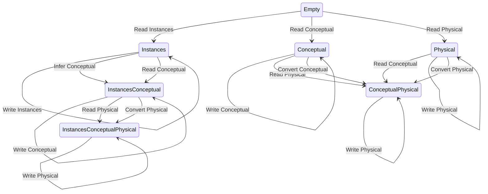

```mermaid
stateDiagram-v2

    Empty --> Instances : Read Instances
    Empty --> Conceptual : Read Conceptual
    Empty --> Physical : Read Physical
    Instances --> Instances : Read Instances
    Instances --> InstancesConceptual : Infer Conceptual
    Instances --> InstancesConceptual : Read Conceptual
    Instances --> Instances : Transform Instances
    Instances --> Instances : Write Instances
    Conceptual --> Conceptual : Read Conceptual
    Conceptual --> ConceptualPhysical : Read Physical
    Conceptual --> ConceptualPhysical : Convert Conceptual
    Conceptual --> Conceptual : Transform Conceptual
    Conceptual --> Conceptual : Write Conceptual
    Physical --> ConceptualPhysical : Read Conceptual
    Physical --> Physical : Read Physical
    Physical --> ConceptualPhysical : Convert Physical
    Physical --> Physical : Transform Physical
    Physical --> Physical : Write Physical
    InstancesConceptual --> InstancesConceptual : Read Conceptual
    InstancesConceptual --> InstancesConceptualPhysical : Read Physical
    InstancesConceptual --> InstancesConceptualPhysical : Convert Physical
    InstancesConceptual --> InstancesConceptual : Transform Conceptual
    InstancesConceptual --> InstancesConceptual : Write Instances
    InstancesConceptual --> InstancesConceptual : Write Conceptual
    ConceptualPhysical --> ConceptualPhysical : Read Physical
    ConceptualPhysical --> ConceptualPhysical : Transform Physical
    ConceptualPhysical --> ConceptualPhysical : Write Conceptual
    ConceptualPhysical --> ConceptualPhysical : Write Physical
    InstancesConceptualPhysical --> InstancesConceptualPhysical : Read Physical
    InstancesConceptualPhysical --> InstancesConceptualPhysical : Transform Physical
    InstancesConceptualPhysical --> InstancesConceptualPhysical : Write Instances
    InstancesConceptualPhysical --> InstancesConceptualPhysical : Write Conceptual
    InstancesConceptualPhysical --> InstancesConceptualPhysical : Write Physical
```