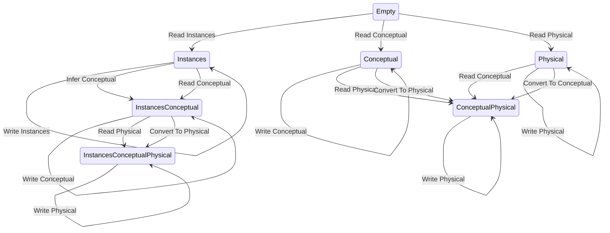

```mermaid
stateDiagram-v2

    %% We have three potential flows from Empty state
    %% one which invovles dealing with entire knowledge graph (instances + data model)
    %% and other two which are data model only
    Empty --> Instances : Read Instances
    Empty --> Conceptual : Read Conceptual
    Empty --> Physical : Read Physical


    %% This is usually the flow which leverages all neat capabilities
    %% it starts with instances, followed by conceptual and physical data models
    Instances --> Instances : Read Instances
    Instances --> Instances : Transform Instances
    Instances --> Instances : Write Instances

    %% These are two ways how conceptual data model can be added to neat session
    %% either infering data model from instancnes or reading in existing data model
    Instances --> InstancesConceptual : Infer Conceptual
    Instances --> InstancesConceptual : Read Conceptual

    %% At this state we can read in new conceptual data model, transform existing
    %% and can write out instances and data model from the neat session
    InstancesConceptual --> InstancesConceptual : Read Conceptual
    InstancesConceptual --> InstancesConceptual : Transform Conceptual
    InstancesConceptual --> InstancesConceptual : Write Instances
    InstancesConceptual --> InstancesConceptual : Write Conceptual

    %% To get to the final state of this flow we can either read physical data model
    %% or convert conceptual data model to the physical representation
    InstancesConceptual --> InstancesConceptualPhysical : Read Physical
    InstancesConceptual --> InstancesConceptualPhysical : Convert To Physical

    %% At the final state we can read new physical data model, transform it,
    %% and can write out now all three objects (instances, conceptual and physical data model)
    InstancesConceptualPhysical --> InstancesConceptualPhysical : Read Physical
    InstancesConceptualPhysical --> InstancesConceptualPhysical : Transform Physical
    InstancesConceptualPhysical --> InstancesConceptualPhysical : Write Instances
    InstancesConceptualPhysical --> InstancesConceptualPhysical : Write Conceptual
    InstancesConceptualPhysical --> InstancesConceptualPhysical : Write Physical


    %% Data modeling flow which follows conceptual -> physical state
    %% or simply ends either at Conceptual or Physical state
    Conceptual --> Conceptual : Read Conceptual
    Conceptual --> Conceptual : Transform Conceptual
    Conceptual --> Conceptual : Write Conceptual

    %% which then transitions to the final state either via reading
    %% or converting to physical data model
    Conceptual --> ConceptualPhysical : Read Physical
    Conceptual --> ConceptualPhysical : Convert To Physical
    
    %% An alternative flows is physical -> conceptual
    Physical --> ConceptualPhysical : Read Conceptual
    Physical --> Physical : Read Physical
    Physical --> ConceptualPhysical : Convert To Conceptual
    Physical --> Physical : Transform Physical
    Physical --> Physical : Write Physical
    
    %% Full data modeling flow ends when having both Conceptual and Physical data model
    ConceptualPhysical --> ConceptualPhysical : Read Physical
    ConceptualPhysical --> ConceptualPhysical : Transform Physical
    ConceptualPhysical --> ConceptualPhysical : Write Conceptual
    ConceptualPhysical --> ConceptualPhysical : Write Physical
    
```